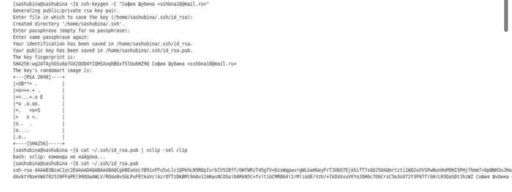
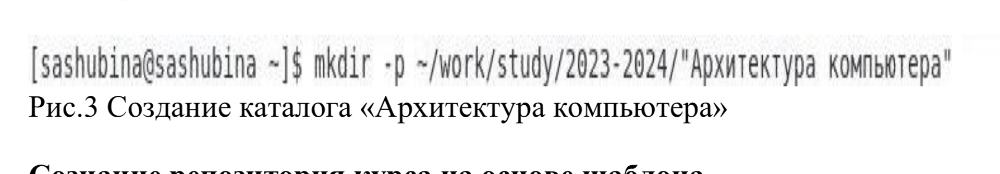
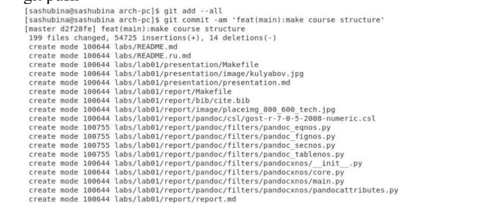
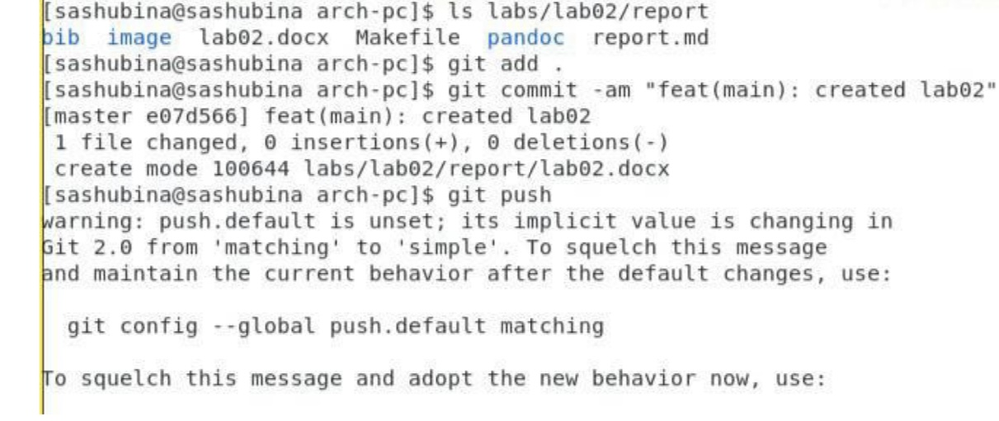

---
## Front matter
title: "Отчёт по лабораторной работе № 2"
subtitle: "НПИбд-02-23"
author: "Шубина София Антоновна"

## Generic otions
lang: ru-RU
toc-title: "Содержание"

## Bibliography
bibliography: bib/cite.bib
csl: pandoc/csl/gost-r-7-0-5-2008-numeric.csl

## Pdf output format
toc: true # Table of contents
toc-depth: 2
lof: true # List of figures
lot: true # List of tables
fontsize: 12pt
linestretch: 1.5
papersize: a4
documentclass: scrreprt
## I18n polyglossia
polyglossia-lang:
  name: russian
  options:
	- spelling=modern
	- babelshorthands=true
polyglossia-otherlangs:
  name: english
## I18n babel
babel-lang: russian
babel-otherlangs: english
## Fonts
mainfont: PT Serif
romanfont: PT Serif
sansfont: PT Sans
monofont: PT Mono
mainfontoptions: Ligatures=TeX
romanfontoptions: Ligatures=TeX
sansfontoptions: Ligatures=TeX,Scale=MatchLowercase
monofontoptions: Scale=MatchLowercase,Scale=0.9
## Biblatex
biblatex: true
biblio-style: "gost-numeric"
biblatexoptions:
  - parentracker=true
  - backend=biber
  - hyperref=auto
  - language=auto
  - autolang=other*
  - citestyle=gost-numeric
## Pandoc-crossref LaTeX customization
figureTitle: "Рис."
tableTitle: "Таблица"
listingTitle: "Листинг"
lofTitle: "Список иллюстраций"
lotTitle: "Список таблиц"
lolTitle: "Листинги"
## Misc options
indent: true
header-includes:
  - \usepackage{indentfirst}
  - \usepackage{float} # keep figures where there are in the text
  - \floatplacement{figure}{H} # keep figures where there are in the text
---

# Цель работы
  Целью работы явлениетс яизучение идеологии и  применение средств контроля версий. Приобрести практические и теоретические навыки по работе с ситемой git.

# Выполнение лабораторной работы
Порядок выполнения лабораторной работы
Настройка github
Существует несколько доступных серверов репозиториев с возможностью бесплатного
размещения данных. Например, http://bitbucket.org/, https://github.com/ и https://gitflic.ru.
Для выполнения лабораторных работ предлагается использовать Github.
Создайте учё тную запись на сайте https://github.com/ и заполните основные данные.
Базовая настройка git
Сначала сделаю предварительную конфигурацию git. Откроем терминал и введем
следующие команды, указав имя и email владельца репозитория:
git config --global user.name "<Name Surname>"
git config --global user.email "<work@mail>"
Настроим utf-8 в выводе сообщений git: git config --global core.quotepath false
Зададим имя начальной ветки (будем называть её master): git config --global
init.defaultBranch master
Параметр autocrlf:
git config --global core.autocrlf input
Параметр safecrlf:
git config --global core.safecrlf warn

(Рис.1) 

{#fig:001 width=70%}

Создание SSH ключа
Для последующей идентификации пользователя на сервере репозиториев необходимо
сгенерировать пару ключей (приватный и открытый):
ssh-keygen -C "Имя Фамилия <work@mail>"
Ключи сохраняться в каталоге ~/.ssh/.
Далее необходимо загрузить сгенерё нный открытый ключ. Для этого зайти на сайт http:
//github.org/ под своей учё тной записью и перейти в меню . После этого выбрать в
боковом меню SSH and GPG keys и нажать кнопку . Скопировав из локальной консоли
ключ в буфер обмена
cat ~/.ssh/id_rsa.pub | xclip -sel clip
вставляем ключ в появившееся на сайте поле и указываем для ключа имя (Title).
(Рис.2) 

{#fig:002 width=70%}

Сознание рабочего пространства и репозитория курса на основе шаблона
При выполнении лабораторных работ следует придерживаться структуры рабочего про-
странства. Рабочее пространство по предмету располагается в следующей иерархии:
Setting
New SSH key
~/work/study/
└── <учебный год>/
└── <название предмета>/
└── <код предмета>/
Например, для 2023–2024 учебного года и предмета «Архитектура компьютера» (код
пред- мета arch-pc) структура каталогов примет следующий вид:
~/work/study/
└── 2023–2024/
└── Архитектура компьютера/
└── arch-pc/
└── labs/
└── lab01/
└── lab02/
└── lab03/
...
• Каталог для лабораторных работ имеет вид labs.
• Каталоги для лабораторных работ имеют вид lab<номер>, например: lab01, lab02 и т.д.
Название проекта на хостинге git имеет вид:study_<учебный год>_<код предмета>
Например, для 2023–2024 учебного года и предмета «Архитектура компьютера» (код
пред- мета arch-pc) название проекта примет следующий вид: study_2023–2024_arch-pc
Откроием терминал и создадим каталог для предмета «Архитектура компьютера»:
mkdir -p ~/work/study/2023-2024/"Архитектура компьютера"
(Рис.3) 

{#fig:003 width=70%}

Создаем ключи для идентификации пользователя на сервере
Сознание репозитория курса на основе шаблона
Репозиторий на основе шаблона можно создать через web-интерфейс github.
Перейдем на станицу репозитория с шаблоном курса https://github.com/yamadharma/cour
se-directory-student-template.
Далее выберем Use this template.
В открывшемся окне задаем имя репозитория(Repository name)study_2023–2024_arh- pc и
создаием репозиторий(кнопкаCreate repository from template).
Откройте терминал и перейдите в каталог курса:
cd ~/work/study/2023–2024/"Архитектура компьютера" клонируем созданный
репозиторий:
git clone --recursive git@github.com:<user_name>/study_2023–2024_arh-pc.git ↪ arch-pc

(Рис.4) 

{#fig:004 width=70%}

Ссылку для клонирования можно скопировать на странице созданного репозитория Code
-> SSH:
Настройка каталога курса
Переходим в каталог курса:
cd ~/work/study/2023-2024/"Архитектура компьютера"/arch-pc Удаляем лишние файлы:
rm package.json
Создаем необходимые каталоги:
echo arch-pc > COURSE
make
(Рис.5) 

{#fig:005 width=70%}

Отправляем файлы на сервер:
git add .
git commit -am 'feat(main): make course structure'
git push
(Рис.6) 

{#fig:006 width=70%}

(Рис.7) 

![Отправка всех произведё нных изменений локального дерева в центральный репозиторий] (image7.jpg){#fig:007 width=70%}

Проверяем правильность создания иерархии рабочего пространства в локальном
репозитории и на странице github.
(Рис.8)

{#fig:008 width=70%}

(Рис.9)

{#fig:009 width=70%}

Задание для самостоятельной работы
1. Создаем отчет по выполнению лабораторной работы в соответствующем каталоге
рабочего пространства (labs>lab02>report).
Рис.10 

{#fig:010 width=70%}

2. Скопируем отчеты по выполнению предыдущих лабораторных работ в
соответствующие каталоги созданного рабочего пространства.
(Рис.11) 

{#fig:011 width=70%}

3.Загрузите файлы на github.\

(Рис.12) 

{#fig:012 width=70%}

# Выводы
Я изучила идеологию и применение средств контроля версий. Приобрела практические и
теоретические навыки с системой git. Научилась применять на практике базовые
команды системы контроля версий

# Список литературы{.unnumbered}
Архитектура ЭВМ
Список литературы
1. GDB: The GNU Project Debugger. — URL: https://www.gnu.org/software/gdb/.
2. GNU Bash Manual. — 2016. — URL: https://www.gnu.org/software/bash/manual/.
3. Midnight Commander Development Center. — 2021. — URL: https://midnight-commander.
org/.
4. NASM Assembly Language Tutorials. — 2021. — URL: https://asmtutor.com/.
5. Newham C. Learning the bash Shell: Unix Shell Programming. — O’Reilly Media, 2005. —
354 с. — (In a Nutshell). — ISBN 0596009658. — URL: http://www.amazon.com/Learning-
bash-Shell-Programming-Nutshell/dp/0596009658.
6. Robbins A. Bash Pocket Reference. — O’Reilly Media, 2016. — 156 с. — ISBN 978-1491941591.
7. The NASM documentation. — 2021. — URL: https://www.nasm.us/docs.php.
8. Zarrelli G. Mastering Bash. — Packt Publishing, 2017. — 502 с. — ISBN 9781784396879.
9. Колдаев В. Д., Лупин С. А. Архитектура ЭВМ. — М. : Форум, 2018.
10. Куляс О. Л., Никитин К. А. Курс программирования на ASSEMBLER. — М. : Солон-Пресс,
2017.
11. Новожилов О. П. Архитектура ЭВМ и систем. — М. : Юрайт, 2016.
12. Расширенный ассемблер: NASM. — 2021. — URL: https://www.opennet.ru/docs/RUS/nasm/.
13. Робачевский А., Немнюгин С., Стесик О. Операционная система UNIX. — 2-е изд. — БХВ-
Петербург, 2010. — 656 с. — ISBN 978-5-94157-538-1.
14. Столяров А. Программирование на языке ассемблера NASM для ОС Unix. — 2-е изд. —
М. : МАКС Пресс, 2011. — URL: http://www.stolyarov.info/books/asm_unix.
15. Таненбаум Э. Архитектура компьютера. — 6-е изд. — СПб. : Питер, 2013. — 874 с. —
(Классика Computer Science).
16. Таненбаум Э., Бос Х. Современные операционные системы. — 4-е изд. — СПб. : Питер,
2015. — 1120 с. — (Классика Computer Science).
