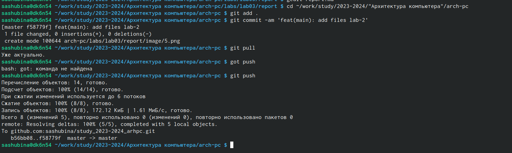

---
## Front matter
title: "Отчет по лабораторной работе №3"
author: "Шубина София Антоновна"

## Generic otions
lang: ru-RU
toc-title: "Содержание"

## Bibliography
bibliography: bib/cite.bib
csl: pandoc/csl/gost-r-7-0-5-2008-numeric.csl

## Pdf output format
toc: true # Table of contents
toc-depth: 2
lof: true # List of figures
lot: true # List of tables
fontsize: 12pt
linestretch: 1.5
papersize: a4
documentclass: scrreprt
## I18n polyglossia
polyglossia-lang:
  name: russian
  options:
	- spelling=modern
	- babelshorthands=true
polyglossia-otherlangs:
  name: english
## I18n babel
babel-lang: russian
babel-otherlangs: english
## Fonts
mainfont: PT Serif
romanfont: PT Serif
sansfont: PT Sans
monofont: PT Mono
mainfontoptions: Ligatures=TeX
romanfontoptions: Ligatures=TeX
sansfontoptions: Ligatures=TeX,Scale=MatchLowercase
monofontoptions: Scale=MatchLowercase,Scale=0.9
## Biblatex
biblatex: true
biblio-style: "gost-numeric"
biblatexoptions:
  - parentracker=true
  - backend=biber
  - hyperref=auto
  - language=auto
  - autolang=other*
  - citestyle=gost-numeric
## Pandoc-crossref LaTeX customization
figureTitle: "Рис."
tableTitle: "Таблица"
listingTitle: "Листинг"
lofTitle: "Список иллюстраций"
lotTitle: "Список таблиц"
lolTitle: "Листинги"
## Misc options
indent: true
header-includes:
  - \usepackage{indentfirst}
  - \usepackage{float} # keep figures where there are in the text
  - \floatplacement{figure}{H} # keep figures where there are in the text
---

# Цель работы

Цель работы:изучение и освоение офрмления отчетов с помощью легковесного языка разметки Markdown.

# Выполнение лабораторной работы
1. Открываем терминал
2. Переходим в каталог курса сформированный при выполнении лабораторной работы
No2:
cd ~/work/study/2023-2024/"Архитектура компьютера"/arch-pc/
(рис.1)

{#fig:001 width=90%}

Обновляем локальный репозиторий, скачав изменения из удаленного репозитория с помо-
щью команды
git pull
(рис.2)

{#fig:002 width=90%}

3. Переходим в каталог с шаблоном отчета по лабораторной работе No 3
cd ~/work/study/2023-2024/"Архитектура компьютера"/arch-pc/labs/lab03/report
4. Проведим компиляцию шаблона с использованием Makefile. Для этого введим ко-
манду
make
При успешной компиляции должны сгенерироваться файлы report.pdf и report.docx.
Откроем и проверяем корректность полученных файлов.
5. Удаляем полученные файлы с использованием Makefile. Для этого введем команду
make clean
Проверим, что после этой команды файлы report.pdf и report.docx были удалены.
6. Откроем файл report.md c помощью любого текстового редактора, например gedit
gedit report.md
Внимательно изучим структуру этого файла.
(рис.3)

{#fig:003 width=70%}

7. Заполним отчет и скомпилируем отчет с использованием Makefile. Проверим кор-
ректность полученных файлов. (Обратите внимание, для корректного отображения
скриншотов они должны быть размещены в каталоге image)
8. Загрузим файлы на Github.
cd ~/work/study/2023-2024/"Архитектура компьютера"/arch-pc
git add .
git commit -am 'feat(main): add files lab-3'
git push
(рис.4)
 
{#fig:004 width=70%}

#Задание для самостоятельной работы
1. В соответствующем каталоге сделайте отчёт по лабораторной работе No 2 в формате
Markdown. В качестве отчёта необходимо предоставить отчёты в 3 форматах: pdf, docx
и md.
(рис.5)

{#fig:005 width=70%}

2. Загрузите файлы на github.

{#fig:006 width=70%}

# Вывод
Я изучила и освоила процедуры офомления отчетов с помощью легковесного языка разметки Markdown.

# Список литературы{.unnumbered}
1. GDB: The GNU Project Debugger. — URL: https://www.gnu.org/software/gdb/.
2. GNU Bash Manual. — 2016. — URL: https://www.gnu.org/software/bash/manual/.
3. Midnight Commander Development Center. — 2021. — URL: https://midnight-commander.
org/.
4. NASM Assembly Language Tutorials. — 2021. — URL: https://asmtutor.com/.
5. Newham C. Learning the bash Shell: Unix Shell Programming. — O’Reilly Media, 2005. —
354 с. — (In a Nutshell). — ISBN 0596009658. — URL: http://www.amazon.com/Learning-
bash-Shell-Programming-Nutshell/dp/0596009658.
6. Robbins A. Bash Pocket Reference. — O’Reilly Media, 2016. — 156 с. — ISBN 978-1491941591.
7. The NASM documentation. — 2021. — URL: https://www.nasm.us/docs.php.
8. Zarrelli G. Mastering Bash. — Packt Publishing, 2017. — 502 с. — ISBN 9781784396879.
9. Колдаев В. Д., Лупин С. А. Архитектура ЭВМ. — М. : Форум, 2018.
10. Куляс О. Л., Никитин К. А. Курс программирования на ASSEMBLER. — М. : Солон-Пресс,
2017.
11. Новожилов О. П. Архитектура ЭВМ и систем. — М. : Юрайт, 2016.
12. Расширенный ассемблер: NASM. — 2021. — URL: https://www.opennet.ru/docs/RUS/nasm/.
13. Робачевский А., Немнюгин С., Стесик О. Операционная система UNIX. — 2-е изд. — БХВ-
Петербург, 2010. — 656 с. — ISBN 978-5-94157-538-1.
14. Столяров А. Программирование на языке ассемблера NASM для ОС Unix. — 2-е изд. —
М. : МАКС Пресс, 2011. — URL: http://www.stolyarov.info/books/asm_unix.
15. Таненбаум Э. Архитектура компьютера. — 6-е изд. — СПб. : Питер, 2013. — 874 с. —
(Классика Computer Science).
16. Таненбаум Э., Бос Х. Современные операционные системы. — 4-е изд. — СПб. : Питер, — 1120 с. — (Классика Computer Science)
