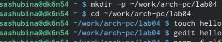
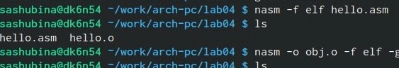
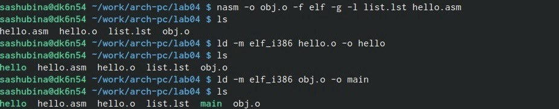
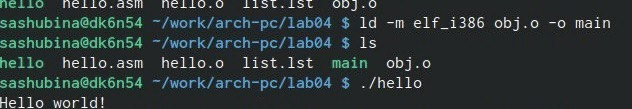
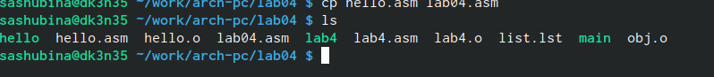
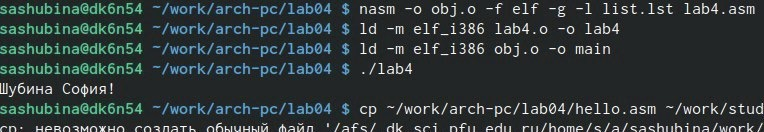
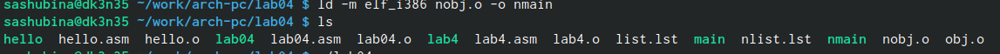

---
## Front matter
title: "Отчет по лабораторной работе №4"
subtitle: "Создание и процесс обработки программ на языке ассемблера NASM"
author: "Шубина София Антоновна"

## Generic otions
lang: ru-RU
toc-title: "Содержание"

## Bibliography
bibliography: bib/cite.bib
csl: pandoc/csl/gost-r-7-0-5-2008-numeric.csl

## Pdf output format
toc: true # Table of contents
toc-depth: 2
lof: true # List of figures
lot: true # List of tables
fontsize: 12pt
linestretch: 1.5
papersize: a4
documentclass: scrreprt
## I18n polyglossia
polyglossia-lang:
  name: russian
  options:
	- spelling=modern
	- babelshorthands=true
polyglossia-otherlangs:
  name: english
## I18n babel
babel-lang: russian
babel-otherlangs: english
## Fonts
mainfont: PT Serif
romanfont: PT Serif
sansfont: PT Sans
monofont: PT Mono
mainfontoptions: Ligatures=TeX
romanfontoptions: Ligatures=TeX
sansfontoptions: Ligatures=TeX,Scale=MatchLowercase
monofontoptions: Scale=MatchLowercase,Scale=0.9
## Biblatex
biblatex: true
biblio-style: "gost-numeric"
biblatexoptions:
  - parentracker=true
  - backend=biber
  - hyperref=auto
  - language=auto
  - autolang=other*
  - citestyle=gost-numeric
## Pandoc-crossref LaTeX customization
figureTitle: "Рис."
tableTitle: "Таблица"
listingTitle: "Листинг"
lofTitle: "Список иллюстраций"
lotTitle: "Список таблиц"
lolTitle: "Листинги"
## Misc options
indent: true
header-includes:
  - \usepackage{indentfirst}
  - \usepackage{float} # keep figures where there are in the text
  - \floatplacement{figure}{H} # keep figures where there are in the text
---

# Цель работы

Освоение процедуры компиляции и сборки программ, написанных на ассемблере NASM. Получить теоретические и практические навыки.

# Выполнение лабораторной работы

Рассмотрим пример простой программы на языке ассемблера NASM. Традиционно первая
программа выводит приветственное сообщение Hello world! на экран.
Создаю каталог для работы с программами на языке ассемблера NASM:
mkdir -p ~/work/arch-pc/lab04!
Перехожу в созданный каталог
cd ~/work/arch-pc/lab04
(Рис. @fig:001)

{#fig:001 width=70%}

Создаю текстовый файл с именем hello.asm
touch hello.asm
Открываю этот файл с помощью любого текстового редактора, например, gedit
gedit hello.asm
(Рис. @fig:002) 

{#fig:002 width=70%}

И ввожу в него следующий текст:
; hello.asm
SECTION .data ; Начало секции данных
hello: DB 'Hello world!',10 ; 'Hello world!' плюс
; символ перевода строки
helloLen: EQU $-hello ; Длина строки hello
SECTION .text ; Начало секции кода
GLOBAL _start
_start: ; Точка входа в программу
mov eax,4 ; Системный вызов для записи (sys_write)
mov ebx,1 ; Описатель файла '1' - стандартный вывод
mov ecx,hello ; Адрес строки hello в ecx
mov edx,helloLen ; Размер строки hello
int 80h ; Вызов ядра
mov eax,1 ; Системный вызов для выхода (sys_exit)
mov ebx,0 ; Выход с кодом возврата '0' (без ошибок)
int 80h ; Вызов ядра

В отличие от многих современных высокоуровневых языков программирования, в ас-
семблерной программе каждая команда располагается на отдельной строке. Размещение
нескольких команд на одной строке недопустимо. Синтаксис ассемблера NASM является
чувствительным к регистру, т.е. есть разница между большими и малыми буквами.
NASM превращает текст программы в объектный код. Например, для компиляции приве-
дённого выше текста программы «Hello World» необходимо написать:

nasm -f elf hello.asm

Если текст программы набран без ошибок, то транслятор преобразует текст программы
из файла hello.asm в объектный код, который запишется в файл hello.o. Таким образом,
имена всех файлов получаются из имени входного файла и расширения по умолчанию.
При наличии ошибок объектный файл не создаётся, а после запуска транслятора появятся
сообщения об ошибках или предупреждения.

С помощью команды ls проверим, что объектный файл был создан. Какое имя имеет
объектный файл?
Объектный файл имеет имя-hello .o

(Рис. @fig:003)

{#fig:003 width=70%}

NASM не запускают без параметров. Ключ -f указывает транслятору, что требуется создать
бинарные файлы в формате ELF. Следует отметить, что формат elf64 позволяет создавать
исполняемый код, работающий под 64-битными версиями Linux. Для 32-битных версий ОС
указываем в качестве формата просто elf.
NASM всегда создаёт выходные файлы в текущем каталоге.
 Расширенный синтаксис командной строки NASM
Полный вариант командной строки nasm выглядит следующим образом:
nasm [-@ косвенный_файл_настроек] [-o объектный_файл] [-f
формат_объектного_файла] [-l листинг] [параметры...] [--] исходный_файл↪

Выполним следующую команду:
nasm -o obj.o -f elf -g -l list.lst hello.asm (Рис.3)

Данная команда скомпилирует исходный файл hello.asm в obj.o (опция -o позволяет
задать имя объектного файла, в данном случае obj.o), при этом формат выходного файла
будет elf, и в него будут включены символы для отладки (опция -g), кроме того, будет создан
файл листинга list.lst (опция -l).

С помощью команды ls проверим, что файлы были созданы.

Для более подробной информации см. man nasm. Для получения списка форматов объект-
ного файла см. nasm -hf.

Объектный файл необходимо передать на обработку компоновщику:
ld -m elf_i386 hello.o -o hello(Рис.3)

С помощью команды ls проверим, что исполняемый файл hello был создан.
Компоновщик ld не предполагает по умолчанию расширений для файлов, но принято
использовать следующие расширения:
• o – для объектных файлов;
• без расширения – для исполняемых файлов;
• map – для файлов схемы программы;
• lib – для библиотек.
Ключ -o с последующим значением задаёт в данном случае имя создаваемого исполняе-
мого файла.

Выполним следующую команду:
ld -m elf_i386 obj.o -o main
(Рис.2.4)
(Рис. @fig:004)
{#fig:004 width=70%}

Какое имя будет иметь исполняемый файл? Какое имя имеет объектный файл из которого
собран этот исполняемый файл?
Имя исполняемого файла-main,объектный файл-hello
Формат командной строки LD можно увидеть, набрав ld --help. Для получения более
подробной информации см. man ld.

Запуск исполняемого файла
Запустить на выполнение созданный исполняемый файл, находящийся в текущем каталоге,
можно, набрав в командной строке:
./hello
(Рис. @fig:005)

{#fig:005 width=70%}

# Задание для самостоятельной работы
1. В каталоге ~/work/arch-pc/lab04 с помощью команды cp создадим копию файла
hello.asm с именем lab4.asm
(Рис. @fig:006)

{#fig:006 width=70%}

2. С помощью любого текстового редактора внесем изменения в текст программы в
файле lab4.asm так, чтобы вместо Hello world! на экран выводилась строка с нашими
фамилией и именем.
(Рис. @fig:007)

{#fig:007 width=70%}

3. Оттранслируем полученный текст программы lab4.asm в объектный файл. Выполним
компоновку объектного файла и запустим получившийся исполняемый файл.
(Рис. @fig:008)
{#fig:008 width=70%}

4. Скопируем файлы hello.asm и lab4.asm в Наш локальный репозиторий в ката-
лог ~/work/study/2023-2024/"Архитектура компьютера"/arch-pc/labs/lab04/.
Загрузим файлы на Github

# Выводы

Я освоила процедуру кампиляции и сборку программ,наприсанныз на ассемблере NASM. Изучила теоремический материал и приобрела практические навыки.

# Список литературы{.unnumbered}
1. GDB: The GNU Project Debugger. — URL: https://www.gnu.org/software/gdb/.
2. GNU Bash Manual. — 2016. — URL: https://www.gnu.org/software/bash/manual/.
3. Midnight Commander Development Center. — 2021. — URL: https://midnight-commander.
org/.
4. NASM Assembly Language Tutorials. — 2021. — URL: https://asmtutor.com/.
5. Newham C. Learning the bash Shell: Unix Shell Programming. — O’Reilly Media, 2005. —
354 с. — (In a Nutshell). — ISBN 0596009658. — URL: http://www.amazon.com/Learning-
bash-Shell-Programming-Nutshell/dp/0596009658.
6. Robbins A. Bash Pocket Reference. — O’Reilly Media, 2016. — 156 с. — ISBN 978-1491941591.
7. The NASM documentation. — 2021. — URL: https://www.nasm.us/docs.php.
8. Zarrelli G. Mastering Bash. — Packt Publishing, 2017. — 502 с. — ISBN 9781784396879.
9. Колдаев В. Д., Лупин С. А. Архитектура ЭВМ. — М. : Форум, 2018.
10. Куляс О. Л., Никитин К. А. Курс программирования на ASSEMBLER. — М. : Солон-Пресс,
2017.
11. Новожилов О. П. Архитектура ЭВМ и систем. — М. : Юрайт, 2016.
12. Расширенный ассемблер: NASM. — 2021. — URL: https://www.opennet.ru/docs/RUS/nasm/.
13. Робачевский А., Немнюгин С., Стесик О. Операционная система UNIX. — 2-е изд. — БХВ-
Петербург, 2010. — 656 с. — ISBN 978-5-94157-538-1.
14. Столяров А. Программирование на языке ассемблера NASM для ОС Unix. — 2-е изд. —
М. : МАКС Пресс, 2011. — URL: http://www.stolyarov.info/books/asm_unix.
15. Таненбаум Э. Архитектура компьютера. — 6-е изд. — СПб. : Питер, 2013. — 874 с. —
(Классика Computer Science).
16. Таненбаум Э., Бос Х. Современные операционные системы. — 4-е изд. — СПб. : Питер,
2015. — 1120 с. — (Классика Computer Science).
