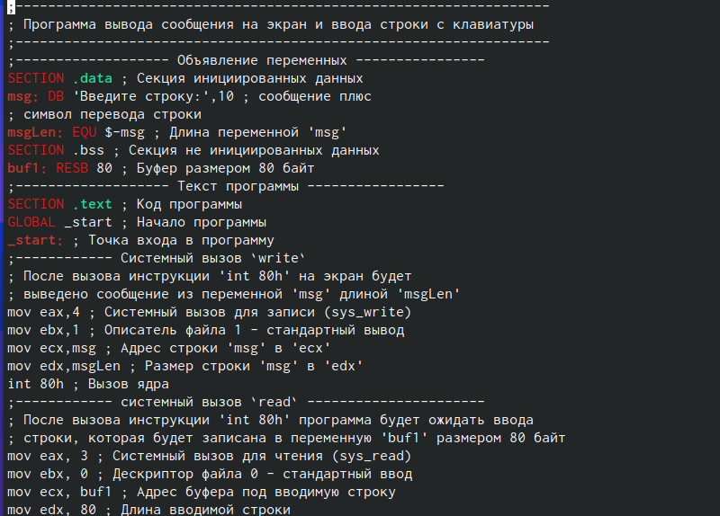
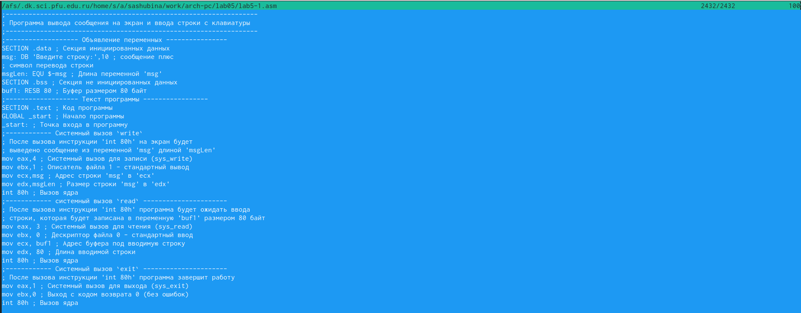
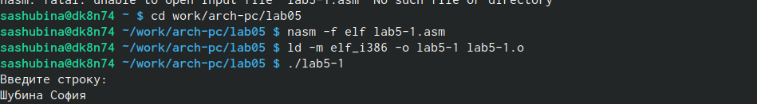
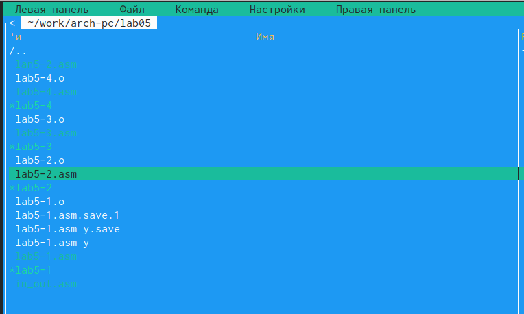
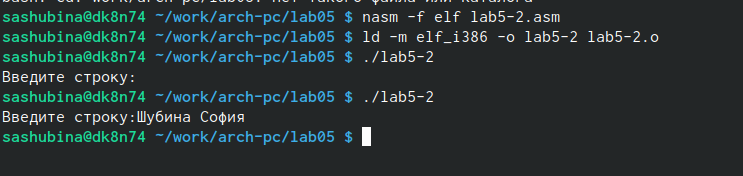
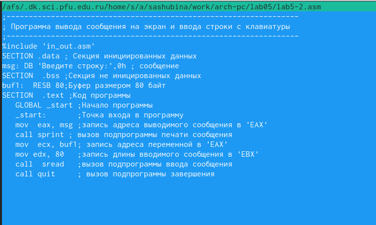
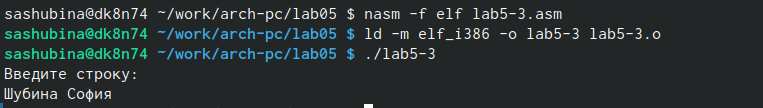
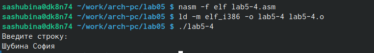

---
## Front matter
title: "Отчет по лабораторной работе №5"
author: "Шубина София Антоновна"

## Generic otions
lang: ru-RU
toc-title: "Содержание"

## Bibliography
bibliography: bib/cite.bib
csl: pandoc/csl/gost-r-7-0-5-2008-numeric.csl

## Pdf output format
toc: true # Table of contents
toc-depth: 2
lof: true # List of figures
lot: true # List of tables
fontsize: 12pt
linestretch: 1.5
papersize: a4
documentclass: scrreprt
## I18n polyglossia
polyglossia-lang:
  name: russian
  options:
	- spelling=modern
	- babelshorthands=true
polyglossia-otherlangs:
  name: english
## I18n babel
babel-lang: russian
babel-otherlangs: english
## Fonts
mainfont: PT Serif
romanfont: PT Serif
sansfont: PT Sans
monofont: PT Mono
mainfontoptions: Ligatures=TeX
romanfontoptions: Ligatures=TeX
sansfontoptions: Ligatures=TeX,Scale=MatchLowercase
monofontoptions: Scale=MatchLowercase,Scale=0.9
## Biblatex
biblatex: true
biblio-style: "gost-numeric"
biblatexoptions:
  - parentracker=true
  - backend=biber
  - hyperref=auto
  - language=auto
  - autolang=other*
  - citestyle=gost-numeric
## Pandoc-crossref LaTeX customization
figureTitle: "Рис."
tableTitle: "Таблица"
listingTitle: "Листинг"
lofTitle: "Список иллюстраций"
lotTitle: "Список таблиц"
lolTitle: "Листинги"
## Misc options
indent: true
header-includes:
  - \usepackage{indentfirst}
  - \usepackage{float} # keep figures where there are in the text
  - \floatplacement{figure}{H} # keep figures where there are in the text
---

# Цель работы

Приобретение практических навыков работы в Midnight Commander. Освоение инструкций
языка ассемблера mov и int.

#Порядок выполнения лабораторной работы

1. Откроем Midnight Commander
user@dk4n31:~$ mc (рис @fig:001)

{#fig:001 width=70%}

2. Пользуясь клавишами ↑ , ↓ и Enter перейдием в каталог ~/work/arch-pc созданный
при выполнении лабораторной работы №4.
3. С помощью функциональной клавиши F7 создаем папку lab05 и переходим
в созданный каталог.
4. Пользуясь строкой ввода и командой touch создаем файл lab5-1.asm.
5. С помощью функциональной клавиши F4 откроем файл lab5-1.asm для редактирова-
ния во встроенном редакторе. Как правило в качестве встроенного редактора Midnight
Commander используется редакторы nano или mcedit.

6. Введем текст программы из листинга (можно без комментариев), сохраним изме-
нения и закроем файл.(рис @fig:002)

{#fig:002 width=70%}

7. С помощью функциональной клавиши F3 откроем файл lab5-1.asm для просмотра.
Убедимся, что файл содержит текст программы.(рис @fig:003)

{#fig:003 width=70%}

8. Оттранслируем текст программы lab5-1.asm в объектный файл. Выполним компо-
новку объектного файла и запустим получившийся исполняемый файл. Программа Архитектура ЭВМ
выводит строку 'Введите строку:' и ожидает ввода с клавиатуры. На запрос введим
Ваши ФИО.
user@dk4n31:~$ nasm -f elf lab5-1.asm
user@dk4n31:~$ ld -m elf_i386 -o lab5-1 lab5-1.o
user@dk4n31:~$ ./lab5-1
Введите строку:
Имя пользователя
user@dk4n31:~$
Скрыть панели Midnight Commander, за которыми доступен для работы командный
интерпретатор оболочки, можно с помощью комбинации Ctrl + o (или через меню
Команда > Отключить панели ).
одключение внешнего файла in_out.asm
Для упрощения написания программ часто встречающиеся одинаковые участки кода
(такие как, например, вывод строки на экран или выход их программы) можно оформить
в виде подпрограмм и сохранить в отдельные файлы, а во всех нужных местах поставить
вызов нужной подпрограммы. Это позволяет сделать основную программу более удобной
для написания и чтения.
NASM позволяет подключать внешние файлы с помощью директивы %include, которая
предписывает ассемблеру заменить эту директиву содержимым файла. Подключаемые фай-
лы также написаны на языке ассемблера. Важно отметить, что директива %include в тексте
программы должна стоять раньше, чем встречаются вызовы подпрограмм из подключае-
мого файла. Для вызова подпрограммы из внешнего файла используется инструкция call,
которая имеет следующий вид
call <function>
где function имя подпрограммы.
Для выполнения лабораторных работ используется файл in_out.asm1, который содержит
следующие подпрограммы [4]:
• slen – вычисление длины строки (используется в подпрограммах печати сообщения
для определения количества выводимых байтов);
• sprint – вывод сообщения на экран, перед вызовом sprint в регистр eax необходимо
записать выводимое сообщение (mov eax,<message>);
• sprintLF – работает аналогично sprint, но при выводе на экран добавляет к сообще-
нию символ перевода строки;
• sread – ввод сообщения с клавиатуры, перед вызовом sread в регистр eax необходи-
мо записать адрес переменной в которую введенное сообщение буд записано (mov
eax,<buffer>) , в регистр ebx – длину вводимой строки (mov ebx,<N>);
iprint – вывод на экран чисел в формате ASCII, перед вызовом iprint в регистр eax
необходимо записать выводимое число (mov eax,<int>);
• iprintLF – работает аналогично iprint, но при выводе на экран после числа добавляет
к символ перевода строки;
• atoi – функция преобразует ascii-код символа в целое число и записыает результат
в регистр eax, перед вызовом atoi в регистр eax необходимо записать число (mov
eax,<int>);
• quit – завершение программы.(рис @fig:004)

{#fig:004 width=70%}

9. Скачаем файл in_out.asm со страницы курса в ТУИС.
10. Подключаемый файл in_out.asm должен лежать в том же каталоге, что и файл с про-
граммой, в которой он используется.
В одной из панелей mc откроем каталог с файлом lab5-1.asm. В другой панели каталог
со скаченным файлом in_out.asm (для перемещения между панелями используем Tab ).
Скопируем файл in_out.asm в каталог с файлом lab5-1.asm с помощью функциональной
клавиши F5 
11. С помощью функциональной клавиши F6 создаем копию файла lab5-1.asm с именем
lab5-2.asm. Выделим файл lab5-1.asm, нажмем клавишу F6 , введем имя файла
lab5-2.asm и нажмем клавишу Enter (рис @fig:005)

{#fig:005 width=70%}

12. Исправим текст программы в файле lab5-2.asm с использование подпрограмм из
внешнего файла in_out.asm (используем подпрограммы sprintLF, sread и quit) в
соответствии с листингом. Создаем исполняемый файл и проверьте его работу(рис @fig:006)

{#fig:006 width=70%}

13. В файле lab5-2.asm замените подпрограмму sprintLF на sprint. Создайте исполняе-
мый файл и проверьте его работу. В чем разница?
sprintLF-переносит строку, в этом различие(рис @fig:007)

{#fig:007 width=70%}

# Задание для самостоятельной работы
1. Создадим копию файла lab5-1.asm. Внесем изменения в программу (без использова-
ния внешнего файла in_out.asm), так чтобы она работала по следующему алгоритму:
• вывести приглашение типа “Введите строку:”;
• ввести строку с клавиатуры;
• вывести введённую строку на экран.

2. Получим исполняемый файл и проверим его работу. На приглашение ввести строку
введем свою фамилию (рис @fig:008)

{#fig:008 width=70%}

3. Создадим копию файла lab5-2.asm. Исправим текст программы с использование под-
программ из внешнего файла in_out.asm, так чтобы она работала по следующему
алгоритму:
• вывести приглашение типа “Введите строку:”;
• ввести строку с клавиатуры;
• вывести введённую строку на экран.
Не забудим,что подключаемый файл in_out.asm должен лежать в том же каталоге, что и
файл с программой, в которой он используется.

4. Создадим исполняемый файл и проверьте его работу.(рис @fig:009)

{#fig:009 width=70%}

# Вывод
Я приобрела практические навыки работы в Midnight Commander.Освоила инструкции
языка ассемблера mov и int.

# Список литературы{.unnumbered}
. GDB: The GNU Project Debugger. — URL: https://www.gnu.org/software/gdb/.
2. GNU Bash Manual. — 2016. — URL: https://www.gnu.org/software/bash/manual/.
3. Midnight Commander Development Center. — 2021. — URL: https://midnight-commander.
org/.
4. NASM Assembly Language Tutorials. — 2021. — URL: https://asmtutor.com/.
5. Newham C. Learning the bash Shell: Unix Shell Programming. — O’Reilly Media, 2005. —
354 с. — (In a Nutshell). — ISBN 0596009658. — URL: http://www.amazon.com/Learning-
bash-Shell-Programming-Nutshell/dp/0596009658.
6. Robbins A. Bash Pocket Reference. — O’Reilly Media, 2016. — 156 с. — ISBN 978-1491941591.
7. The NASM documentation. — 2021. — URL: https://www.nasm.us/docs.php.
8. Zarrelli G. Mastering Bash. — Packt Publishing, 2017. — 502 с. — ISBN 9781784396879.
9. Колдаев В. Д., Лупин С. А. Архитектура ЭВМ. — М. : Форум, 2018.
10. Куляс О. Л., Никитин К. А. Курс программирования на ASSEMBLER. — М. : Солон-Пресс,
2017.
11. Новожилов О. П. Архитектура ЭВМ и систем. — М. : Юрайт, 2016.
12. Расширенный ассемблер: NASM. — 2021. — URL: https://www.opennet.ru/docs/RUS/nasm/.
13. Робачевский А., Немнюгин С., Стесик О. Операционная система UNIX. — 2-е изд. — БХВ-
Петербург, 2010. — 656 с. — ISBN 978-5-94157-538-1.
14. Столяров А. Программирование на языке ассемблера NASM для ОС Unix. — 2-е изд. —
М. : МАКС Пресс, 2011. — URL: http://www.stolyarov.info/books/asm_unix.
15. Таненбаум Э. Архитектура компьютера. — 6-е изд. — СПб. : Питер, 2013. — 874 с. —
(Классика Computer Science).
16. Таненбаум Э., Бос Х. Современные операционные системы. — 4-е изд. — СПб. : Питер,
2015. — 1120 с. — (Классика Computer Science).

