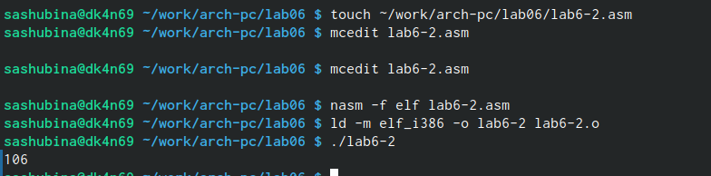

---
## Front matter
title: "Отчет по лабораторной работе №6"
author: "Шубина София Антоновна"

## Generic otions
lang: ru-RU
toc-title: "Содержание"

## Bibliography
bibliography: bib/cite.bib
csl: pandoc/csl/gost-r-7-0-5-2008-numeric.csl

## Pdf output format
toc: true # Table of contents
toc-depth: 2
lof: true # List of figures
lot: true # List of tables
fontsize: 12pt
linestretch: 1.5
papersize: a4
documentclass: scrreprt
## I18n polyglossia
polyglossia-lang:
  name: russian
  options:
	- spelling=modern
	- babelshorthands=true
polyglossia-otherlangs:
  name: english
## I18n babel
babel-lang: russian
babel-otherlangs: english
## Fonts
mainfont: PT Serif
romanfont: PT Serif
sansfont: PT Sans
monofont: PT Mono
mainfontoptions: Ligatures=TeX
romanfontoptions: Ligatures=TeX
sansfontoptions: Ligatures=TeX,Scale=MatchLowercase
monofontoptions: Scale=MatchLowercase,Scale=0.9
## Biblatex
biblatex: true
biblio-style: "gost-numeric"
biblatexoptions:
  - parentracker=true
  - backend=biber
  - hyperref=auto
  - language=auto
  - autolang=other*
  - citestyle=gost-numeric
## Pandoc-crossref LaTeX customization
figureTitle: "Рис."
tableTitle: "Таблица"
listingTitle: "Листинг"
lofTitle: "Список иллюстраций"
lotTitle: "Список таблиц"
lolTitle: "Листинги"
## Misc options
indent: true
header-includes:
  - \usepackage{indentfirst}
  - \usepackage{float} # keep figures where there are in the text
  - \floatplacement{figure}{H} # keep figures where there are in the text
---

# Цель работы

Освоение арифметических инструкций языка ассемблера NASM.


#Порядок выполнения лабораторной работы

1. Создадим каталог для программам лабораторной работы No 6, перейдем в него и
создадим файл lab6-1.asm:
mkdir ~/work/arch-pc/lab06
cd ~/work/arch-pc/lab06
touch lab6-1.asm (рис @fig:001)

{#fig:001 width=70%}

2. Рассмотрим примеры программ вывода символьных и численных значений. Програм-
мы будут выводить значения записанные в регистр eax.
Введем в файл lab6-1.asm текст программы из листинга 6.1. 
В данной программе в регистр eax записывается символ 6 (mov eax,'6'), 
в регистр ebx символ 4 (mov ebx,'4').
Далее к значению в регистре eax прибавляем значение регистра ebx (add eax,ebx, результат сложения запишется в регистр eax). Далее выводим результат. Так как для работы
функции sprintLF в регистр eax должен быть записан адрес, необходимо использовать до-
полнительную переменную. Для этого запишем значение регистра eax в переменную buf1
(mov [buf1],eax), а затем запишем адрес переменной buf1 в регистр eax (mov eax,buf1) и
вызовем функцию sprintLF.

Листинг 6.1. Программа вывода значения регистра eax
%include 'in_out.asm'
SECTION .bss
buf1: RESB 80
SECTION .text
GLOBAL _start
_start:
mov eax,'6'
mov ebx,'4'
add eax,ebx
mov [buf1],eax
mov eax,buf1
call sprintLF
call quit (рис @fig:002)
{#fig:002 width=70%}

Создаем исполняемый файл и запускаем его.
nasm -f elf lab6-1.asm
ld -m elf_i386 -o lab6-1 lab6-1.o
./lab6-1 (рис @fig:003)

{#fig:003 width=70%}

ВАЖНО! Для корректной работы программы подключаемый файл in_out.asm должен
лежать в том же каталоге, что и файл с текстом программы. Перед созданием исполня-
емого файла создайте копию файла in_out.asm в каталоге ~/work/arch-pc/lab06.
В данном случае при выводе значения регистра eax мы ожидаем увидеть число 10. Однако
результатом будет символ j. Это происходит потому, что код символа 6 равен 00110110 в
двоичном представлении (или 54 в десятичном представлении), а код символа 4 – 00110100
(52). Команда add eax,ebx запишет в регистр eax сумму кодов – 01101010 (106), что в свою
очередь является кодом символа j (см. таблицу ASCII в приложении).
3. Далее изменим текст программы и вместо символов, запишем в регистры числа. Ис-
правим текст программы (Листинг 6.1) следующим образом: заменим строки

mov eax,'6'
mov ebx,'4'
на строки
mov eax,6
mov ebx,4
(рис @fig:004)

{#fig:004 width=70%}

Создадим исполняемый файл и запустим его. (рис @fig:005)

{#fig:005 width=70%}

Как и в предыдущем случае при исполнении программы мы не получим число 10. В данном
случае выводится символ с кодом 10. 
Пользуясь таблицей ASCII определим какому символу
соответствует код 10: LF, символ переноса строки
Отображается ли этот символ при выводе на экран?-нет, не отображается
4. Как отмечалось выше, для работы с числами в файле in_out.asm реализованы подпро-
граммы для преобразования ASCII символов в числа и обратно. Преобразуем текст
программы из Листинга 6.1 с использованием этих функций.
Создадим файл lab6-2.asm в каталоге ~/work/arch-pc/lab06 и введем в него текст про-
граммы из листинга 6.2.
touch ~/work/arch-pc/lab06/lab6-2.asm 
Листинг 6.2. 
Программа вывода значения регистра eax
%include 'in_out.asm'
SECTION .text
GLOBAL _start
_start:
mov eax,'6'
mov ebx,'4'
add eax,ebx
call iprintLF
call quit (рис @fig:006)

{#fig:006 width=70%}

Создадим исполняемый файл и запустим его.
nasm -f elf lab6-2.asm
ld -m elf_i386 -o lab6-2 lab6-2.o
./lab6-2 (рис @fig:007)

{#fig:007 width=70%}

В результате работы программы мы получим число 106. В данном случае, как и в первом,
команда add складывает коды символов ‘6’ и ‘4’ (54+52=106). Однако, в отличии от программы
из листинга 6.1, функция iprintLF позволяет вывести число, а не символ, кодом которого
является это число.
5. Аналогично предыдущему примеру изменим символы на числа. Заменим строки
mov eax,'6'
mov ebx,'4'
на строки
mov eax,6
mov ebx,4
Создадим исполняемый файл и запустим его. (рис @fig:008)

{#fig:008 width=70%}

Какой результат будет получен при исполне-
нии программы?
Результат-10, при чем результат вывелся с новой строки
Заменим функцию iprintLF на iprint. Создадим исполняемый файл и запустим его. Чем
отличается вывод функций iprintLF и iprint?
iprintLF- это вывод результата с новой строки 
iprint- результат выводится в прошлую строку (рис @fig:009)

{#fig:009 width=70%}

6. В качестве примера выполнения арифметических операций в NASM приведем про-
грамму вычисления арифметического выражения 𝑓(𝑥) = (5 ∗ 2 + 3)/3.
Создадим файл lab6-3.asm в каталоге ~/work/arch-pc/lab06:
touch ~/work/arch-pc/lab06/lab6-3.asm
Внимательно изучим текст программы из листинга 6.3 и введем в lab6-3.asm.
Листинг 6.3. Программа вычисления выражения 𝑓(𝑥) = (5 ∗ 2 + 3)/3
;--------------------------------
; Программа вычисления выражения
;--------------------------------
%include 'in_out.asm' ; подключение внешнего файла
SECTION .data
div: DB 'Результат: ',0
rem: DB 'Остаток от деления: ',0
ECTION .text
GLOBAL _start
_start:
; ---- Вычисление выражения
mov eax,5 ; EAX=5
mov ebx,2 ; EBX=2
mul ebx ; EAX=EAX*EBX
add eax,3 ; EAX=EAX+3
xor edx,edx ; обнуляем EDX для корректной работы div
mov ebx,3 ; EBX=3
div ebx ; EAX=EAX/3, EDX=остаток от деления
mov edi,eax ; запись результата вычисления в 'edi'
; ---- Вывод результата на экран
mov eax,div ; вызов подпрограммы печати
call sprint ; сообщения 'Результат: '
mov eax,edi ; вызов подпрограммы печати значения
call iprintLF ; из 'edi' в виде символов
mov eax,rem ; вызов подпрограммы печати
call sprint ; сообщения 'Остаток от деления: '
mov eax,edx ; вызов подпрограммы печати значения
call iprintLF ; из 'edx' (остаток) в виде символов
call quit ; вызов подпрограммы завершения

Создадим исполняемый файл и запустим его. Результат работы программы должен быть
следующим:
```nasm
user@dk4n31:~ 
./lab6-3
Результат: 4
Остаток от деления: 1
user@dk4n31:~$ (рис @fig:010)
```
{#fig:010 width=70%}
Изменим текст программы для вычисления выражения 𝑓(𝑥) = (4 ∗ 6 + 2)/5. Создадим
исполняемый файл и проверьте его работу. (рис @fig:011)

{#fig:011 width=70%}

(рис @fig:012)

{#fig:012 width=70%}

7. В качестве другого примера рассмотрим программу вычисления варианта задания по
номеру студенческого билета, работающую по следующему алгоритму:
• вывести запрос на введение No студенческого билета
ычислить номер варианта по формуле: (𝑆𝑛 mod 20) + 1, где 𝑆𝑛 – номер студен-
ческого билета (В данном случае 𝑎 mod 𝑏 – это остаток от деления 𝑎 на 𝑏).
• вывести на экран номер варианта.
В данном случае число, над которым необходимо проводить арифметические операции,
вводится с клавиатуры. Как отмечалось выше ввод с клавиатуры осуществляется в символь-
ном виде и для корректной работы арифметических операций в NASM символы необхо-
димо преобразовать в числа. Для этого может быть использована функция atoi из файла
in_out.asm.
Создадим файл variant.asm в каталоге ~/work/arch-pc/lab06:
touch ~/work/arch-pc/lab06/variant.asm (рис @fig:013)

{#fig:013 width=70%}

Внимательно изучим текст программы из листинга 6.4 и введем в файл variant.asm.
Листинг 6.4. 
Программа вычисления вычисления варианта задания по номеру
студенческого билета
;--------------------------------
; Программа вычисления варианта
;--------------------------------
%include 'in_out.asm'
SECTION .data
msg: DB 'Введите No студенческого билета: ',0
rem: DB 'Ваш вариант: ',0
SECTION .bss
x: RESB 80
SECTION .text
GLOBAL _start
_start:
mov eax, msg
call sprintLF
mov ecx, x
mov edx, 80
call sread
mov eax,x ; вызов подпрограммы преобразования
call atoi ; ASCII кода в число, `eax=x`
xor edx,edx
mov ebx,20
div ebx
inc edx
mov eax,rem
call sprint
mov eax,edx
call iprintLF
call quit (рис @fig:014)

{#fig:014 width=70%}

Создадим исполняемый файл и запустим его. Проверим результат работы программы
вычислив номер варианта аналитически.
(рис @fig:015)

{#fig:015 width=70%}

Включим в отчет по выполнению лабораторной работы ответы на следующие вопросы:
1. Какие строки листинга 6.4 отвечают за вывод на экран сообщения ‘Ваш вариант:’?
rem: DB 'Ваш вариант:' в строке объявляется переменнная,куда и записывается искомая строка
mov eax,rem - помещаем строку в регистр  eax
call sprint -вызываем подпрограмму вывода из файла in_out.asm
2. Для чего используется следующие инструкции?
mov ecx, x
mov edx, 80
call sread
Инструкции используются для того, чтобы ввести с клавиатуры строку отведённого размера (80) и поместить её по адресу x. Для этого x помещаем в регистр ecx, а длину строки (80) - в регистр edx. 
call sread - вызовает функции печати.
3. Для чего используется инструкция “call atoi”?
Инструкция call atoi используется для преобразования символов в числа.
4. Какие строки листинга 6.4 отвечают за вычисления варианта?
mov eax,x -поместили x в регистр eax
call atoi -преобразование символов в число
xor edx,edx -обнуляем edx
mov ebx,20 -поместили в регистр ebx число 20
div ebx -поделили число, лежащее в eax, на число, лежащее в ebx •inc edx ;edx + 1
5. В какой регистр записывается остаток от деления при выполнении инструкции “div
ebx”?
Остаток от деления при выполнении div ebx записывается в регистр edx.
6. Для чего используется инструкция “inc edx”?
Инструкция inc edx используется для увеличение значения регистра edx на
1.
7. Какие строки листинга 6.4 отвечают за вывод на экран результата вычислений?
mov eax,edx ;помещаем результат вычислений в регистр eax
call iprintLF ;выводим на экран содержимое регистра eax
#Задания для самостоятельной работы
Написать программу вычисления выражения 𝑦 = 𝑓(𝑥). Программа должна выводить
выражение для вычисления, выводить запрос на ввод значения 𝑥, вычислять задан-
ное выражение в зависимости от введенного 𝑥, выводить результат вычислений. Вид
функции 𝑓(𝑥) выбрать из таблицы 6.3 вариантов заданий в соответствии с номером
полученным при выполнении лабораторной работы. Создайте исполняемый файл и
проверьте его работу для значений 𝑥1 и 𝑥2 из 6.3.
Мой вариант - №6
6: 𝑥3/2 + 1 
х1=2
х2= 5
При выполнении задания преобразовывать (упрощать) выражения для 𝑓(𝑥) нельзя. При
выполнении деления в качестве результата можно использовать только целую часть от
деления и не учитывать остаток (т.е. 5 ∶ 2 = 2)
(рис @fig:016)

{#fig:016 width=70%}

(рис @fig:017)

{#fig:017 width=70%}
```nasm
;--------------------------------
; вариант 6
;--------------------------------
%include 'in_out.asm'
SECTION .data
msg: DB 'Введите x: ',0
rem: DB 'f(x)= ',0
SECTION .bss
x: RESB 80
SECTION .text
GLOBAL _start
_start:
mov eax, msg
call sprintLF
mov ecx, x
mov edx, 80
call sread
mov eax,x ; вызов подпрограммы преобразования
call atoi ; ASCII кода в число, `eax=x`
xor edx,edx

mov ebx,eax
mul ebx
mul ebx
mov ecx,2
div ecx
inc eax
mov edx,eax

mov eax,rem
call sprint
mov eax,edx
call iprintLF
call quit
```

# Вывод
Я освоила арифметические инструкции языка ассемблера NASM.


# Список литературы{.unnumbered}
1. GDB: The GNU Project Debugger. — URL: https://www.gnu.org/software/gdb/.
2. GNU Bash Manual. — 2016. — URL: https://www.gnu.org/software/bash/manual/.
3. Midnight Commander Development Center. — 2021. — URL: https://midnight-commander.
org/.
4. NASM Assembly Language Tutorials. — 2021. — URL: https://asmtutor.com/.
5. Newham C. Learning the bash Shell: Unix Shell Programming. — O’Reilly Media, 2005. —
354 с. — (In a Nutshell). — ISBN 0596009658. — URL: http://www.amazon.com/Learning-
bash-Shell-Programming-Nutshell/dp/0596009658.
6. Robbins A. Bash Pocket Reference. — O’Reilly Media, 2016. — 156 с. — ISBN 978-1491941591.
7. The NASM documentation. — 2021. — URL: https://www.nasm.us/docs.php.
8. Zarrelli G. Mastering Bash. — Packt Publishing, 2017. — 502 с. — ISBN 9781784396879.
9. Колдаев В. Д., Лупин С. А. Архитектура ЭВМ. — М. : Форум, 2018.
10. Куляс О. Л., Никитин К. А. Курс программирования на ASSEMBLER. — М. : Солон-Пресс,
2017.
11. Новожилов О. П. Архитектура ЭВМ и систем. — М. : Юрайт, 2016.
12. Расширенный ассемблер: NASM. — 2021. — URL: https://www.opennet.ru/docs/RUS/nasm/.
13. Робачевский А., Немнюгин С., Стесик О. Операционная система UNIX. — 2-е изд. — БХВ-
Петербург, 2010. — 656 с. — ISBN 978-5-94157-538-1.
14. Столяров А. Программирование на языке ассемблера NASM для ОС Unix. — 2-е изд. —
М. : МАКС Пресс, 2011. — URL: http://www.stolyarov.info/books/asm_unix.
15. Таненбаум Э. Архитектура компьютера. — 6-е изд. — СПб. : Питер, 2013. — 874 с. —
(Классика Computer Science).
16. Таненбаум Э., Бос Х. Современные операционные системы. — 4-е изд. — СПб. : Питер,
2015. — 1120 с. — (Классика Computer Science)
