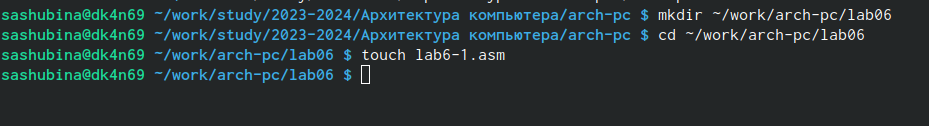
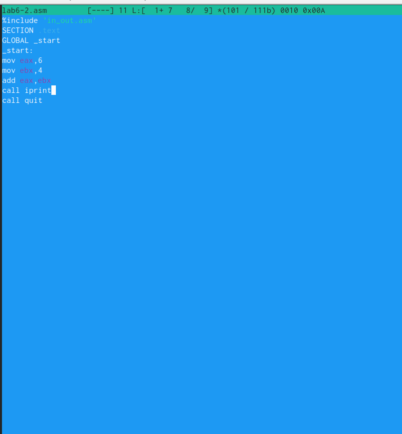
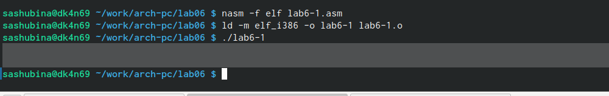
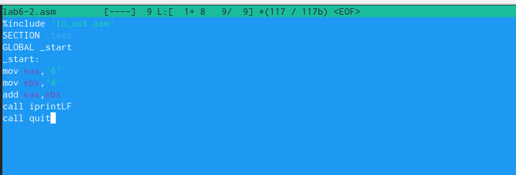
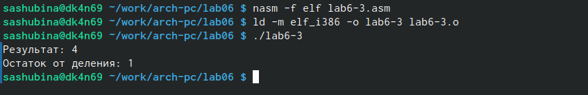
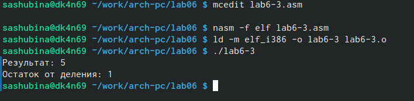
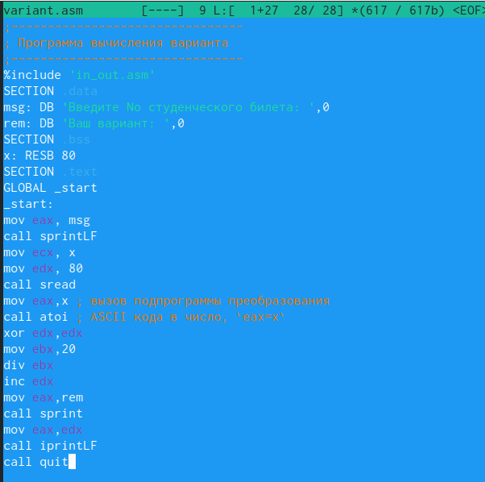
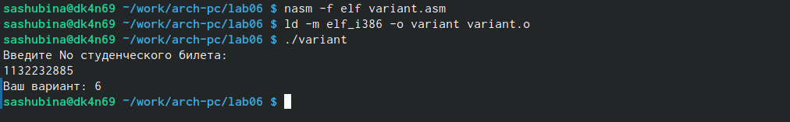
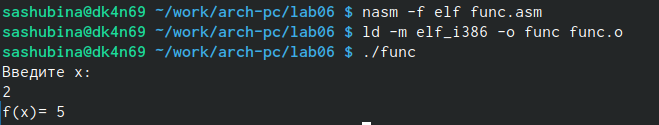

---
## Front matter
title: Лабораторная работа №6 (Установка и настройка системы управления базами данных MariaDB)
author: "Шубина София Антоновна"


## Generic otions
lang: ru-RU
toc-title: "Содержание"

## Bibliography
bibliography: bib/cite.bib
csl: pandoc/csl/gost-r-7-0-5-2008-numeric.csl

## Pdf output format
toc: true # Table of contents
toc-depth: 2
lof: true # List of figures
lot: false # List of tables
fontsize: 12pt
linestretch: 1.5
papersize: a4
documentclass: scrreprt
## I18n polyglossia
polyglossia-lang:
  name: russian
  options:
	- spelling=modern
	- babelshorthands=true
polyglossia-otherlangs:
  name: english
## I18n babel
babel-lang: russian
babel-otherlangs: english
## Fonts
mainfont: PT Serif
romanfont: PT Serif
sansfont: PT Sans
monofont: PT Mono
mainfontoptions: Ligatures=TeX
romanfontoptions: Ligatures=TeX
sansfontoptions: Ligatures=TeX,Scale=MatchLowercase
monofontoptions: Scale=MatchLowercase,Scale=0.9
## Biblatex
biblatex: true
biblio-style: "gost-numeric"
biblatexoptions:
  - parentracker=true
  - backend=biber
  - hyperref=auto
  - language=auto
  - autolang=other*
  - citestyle=gost-numeric
## Pandoc-crossref LaTeX customization
figureTitle: "Рис."
tableTitle: "Таблица"
listingTitle: "Листинг"
lofTitle: "Список иллюстраций"
lotTitle: "Список таблиц"
lolTitle: "Листинги"
## Misc options
indent: true
header-includes:
  - \usepackage{indentfirst}
  - \usepackage{float} # keep figures where there are in the text
  - \floatplacement{figure}{H} # keep figures where there are in the text
---
# Цель работы

Приобрести практические навыки по установке и конфигурированию системы управления базами данных на примере программного обеспечения MariaDB.

# Задание

1. Установить необходимые для работы MariaDB пакеты.

2. Настроить в качестве кодировки символов по умолчанию utf8 в базах данных.

3. В базе данных MariaDB создать тестовую базу addressbook, содержащую таблицу
city с полями name и city, т.е., например, для некоторого сотрудника указан город, в котором он работает.

4. Создать резервную копию базы данных addressbook и восстановите из неё данные.

5. Написать скрипт для Vagrant, фиксирующий действия по установке и настройке базы
данных MariaDB во внутреннем окружении виртуальной машины server. Соответствующим образом внести изменения в Vagrantfile.


# Выполнение лабораторной работы

**Установка MariaDB**

Загрузим операционную систему и перейдем в рабочий каталог с проектом: `cd C:\work\sashubina\vagrant`

Запустим виртуальную машину server: `vagrant up server`

На виртуальной машине server войдем под своим пользователем и откроем терминал. Перейдем в режим суперпользователя:
`sudo -i`
Установим необходимые для работы с базами данных пакеты:

{#fig:001 width=70%}

Просмотрим конфигурационные файлы mariadb в каталоге /etc/my.cnf.d и в файле /etc/my.cnf.

{#fig:002 width=70%}

{#fig:003 width=70%} 

 (/etc/my.cnf):

Основной конфигурационный файл MySQL/MariaDB

Содержит секцию [client-server] для общих настроек клиента и сервера

Включает конфигурационные файлы из директории /etc/my.cnf.d

Минимальная базовая конфигурация

(/etc/my.cnf.d/~.cnf):

Файл из дополнительной конфигурационной директории

Содержит разделы для MariaDB, сервера и демона mysqld

Определены стандартные пути: datadir, socket, логи и PID-файл

Включены настройки для Galera кластеризации

Имеются закомментированные опции для загрузки плагинов


Для запуска и включения программного обеспечения mariadb используем следующие команды:

Убедимся, что mariadb прослушивает порт 3306:

{#fig:004 width=70%}

Запустим скрипт конфигурации безопасности mariadb.
С помощью запустившегося диалога и путём выбора [Y/n] установим пароль для
пользователя root базы данных (обратите внимание, что это не пользователь root
операционной системы), отключим удалённый корневой доступ и удалим тестовую
базу данных и любых анонимных пользователей.

{#fig:005 width=70%}

Для входа в базу данных с правами администратора базы данных введем: `mysql -u root -p`
Просмотрим список команд MySQL, введя `\h`.

{#fig:006 width=70%}

Из приглашения интерактивной оболочки MariaDB для отображения доступных в настоящее время баз данных введем MySQL-запрос `SHOW DATABASES;`
Для выхода из интерфейса интерактивной оболочки MariaDB введите `exit;`

{#fig:007 width=70%}

Видно, что на данный момент есть 4 базы данных (mysql, information_schema, perfomance_schema, sys).

**Конфигурация кодировки символов**

Войдем в базу данных с правами администратора: `mysql -u root -p`
Для отображения статуса MariaDB введем из приглашения интерактивной оболочкиMariaDB: `status`

{#fig:008 width=70%}

Вывелась информация, из которой мы можем узнать, например, текущую бд, текущего пользователя, сервер, версию сервера, версию протокола, набор символов сервера, базы данных и т.д.

В каталоге /etc/my.cnf.d создадим файл utf8.cnf:

```bash
cd /etc/my.cnf.d
touch utf8.cnf
```
{#fig:009 width=70%}

Откроем его на редактирование и укажем в нём следующую конфигурацию:

{#fig:010 width=70%}

Перезапустим MariaDB: `systemctl restart mariadb`
Войдем в базу данных с правами администратора и посмотрим статус MariaDB.

{#fig:011 width=70%}

Увидим, что поменялся стандарт кодирования символов для сервера и базы данных на utf8.

**Создание базы данных**

Войдем в базу данных с правами администратора: `mysql -u root -p`
Создадим базу данных с именем addressbook. Перейдем к базе данных addressbook.
Отобразим имеющиеся в базе данных addressbook таблицы. Создадим таблицу city с полями name и city.
CREATE DATABASE addressbook CHARACTER SET utf8 COLLATE utf8_general_ci;

{#fig:012 width=70%}

 Перейдем к базе данных addressbook
 USE addressbook;

 {#fig:013 width=70%}

 Отобразим имеющиеся в базе данных addressbook таблицы:
 SHOW TABLES;
 Создадим таблицу city с полями name и city:
 CREATE TABLE city(name VARCHAR(40), city VARCHAR(40));

Заполним несколько строк таблицы некоторыми данными по аналогии в соответствии с синтаксисом MySQL:
Добавим в базу сведения о Петрове и Сидорове:
Петров, Сочи
Сидоров, Дубна

{#fig:014 width=70%}

Сделаем следующий MySQL-запрос: `SELECT * FROM city;`. Увидим, что вывелась таблица с колонками город и имя с заполненными мною данными.

{#fig:015 width=70%}

Создадим пользователя для работы с базой данных addressbook и зададим для него пароль:
`CREATE USER sashubina@'%' IDENTIFIED BY 'password';`

Предоставим права доступа созданному пользователю user на действия с базой данных addressbook (просмотр, добавление, обновление, удаление данных): `GRANT SELECT,INSERT,UPDATE,DELETE ON addressbook.* TO user@'%';`

{#fig:016 width=70%}

Обновим привилегии (права доступа) базы данных addressbook: `FLUSH PRIVILEGES;`
Посмотрим общую информацию о таблице city базы данных addressbook: `DESCRIBE city;`

{#fig:017 width=70%}

Выйдем из окружения MariaDB: `quit`
Просмотрим список баз данных: `mysqlshow -u root -p`

{#fig:018 width=70%}

Просмотрим список таблиц базы данных addressbook: `mysqlshow -u user -p addressbook`

{#fig:019 width=70%}

**Резервные копии**

На виртуальной машине server создадим каталог для резервных копий: `mkdir -p /var/backup`
Сделаем резервную копию базы данных addressbook: `mysqldump -u root -p addressbook > /var/backup/addressbook.sql`
Сделаем сжатую резервную копию базы данных addressbook: `mysqldump -u root -p addressbook | gzip > /var/backup/addressbook.sql.gz`
Сделаем сжатую резервную копию базы данных addressbook с указанием даты создания копии: `mysqldump -u root -p addressbook | gzip > $(date +%-Y%-m%-d%-H%.M%.S).sql.gz`
Восстановим базу данных addressbook из резервной копии: `mysql -u root -p addressbook < /var/backup/addressbook.sql`
Восстановим базу данных addressbook из сжатой резервной копии: `zcat /var/backup/addressbook.sql.gz | mysql -u root -p addressbook`

{#fig:020 width=70%}

**Внесение изменений в настройки внутреннего окружения виртуальной машины**

На виртуальной машине server перейдем в каталог для внесения изменений в настройки внутреннего окружения /vagrant/provision/server/, создадим в нём
каталог mysql, в который поместим в соответствующие подкаталоги конфигурационные файлы MariaDB и резервную копию базы данных addressbook:

{#fig:021 width=70%}

В каталоге /vagrant/provision/server создадим исполняемый файл mysql.sh:

```bash
cd /vagrant/provision/server
touch mysql.sh
chmod +x mysql.sh
```
{#fig:022 width=70%}

Открыв его на редактирование, пропишем в нём следующий скрипт:

{#fig:023 width=70%}

Этот скрипт, по сути, повторяет произведённые действия по установке и настройке сервера баз данных.

Для отработки созданного скрипта во время загрузки виртуальных машин в конфигурационном файле Vagrantfile необходимо добавить в конфигурации сервера
следующую запись:

```bash
server.vm.provision "server mysql",
type: "shell",
preserve_order: true,
path: "provision/server/mysql.sh"
```

{#fig:024 width=70%}

# Выводы

В процессе выполения данной лабораторной работы я приобрела практические навыки по установке и конфигурированию системы управления базами данных на примере программного обеспечения MariaDB.
