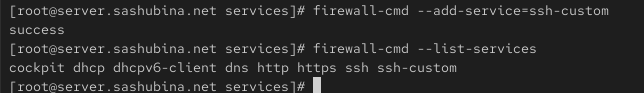
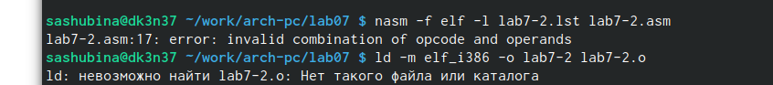

---
## Front matter
title: "Отчет по лабораторной работе №7"
author: "Шубина София Антоновна"

## Generic otions
lang: ru-RU
toc-title: "Содержание"

## Bibliography
bibliography: bib/cite.bib
csl: pandoc/csl/gost-r-7-0-5-2008-numeric.csl

## Pdf output format
toc: true # Table of contents
toc-depth: 2
lof: true # List of figures
lot: true # List of tables
fontsize: 12pt
linestretch: 1.5
papersize: a4
documentclass: scrreprt
## I18n polyglossia
polyglossia-lang:
  name: russian
  options:
	- spelling=modern
	- babelshorthands=true
polyglossia-otherlangs:
  name: english
## I18n babel
babel-lang: russian
babel-otherlangs: english
## Fonts
mainfont: PT Serif
romanfont: PT Serif
sansfont: PT Sans
monofont: PT Mono
mainfontoptions: Ligatures=TeX
romanfontoptions: Ligatures=TeX
sansfontoptions: Ligatures=TeX,Scale=MatchLowercase
monofontoptions: Scale=MatchLowercase,Scale=0.9
## Biblatex
biblatex: true
biblio-style: "gost-numeric"
biblatexoptions:
  - parentracker=true
  - backend=biber
  - hyperref=auto
  - language=auto
  - autolang=other*
  - citestyle=gost-numeric
## Pandoc-crossref LaTeX customization
figureTitle: "Рис."
tableTitle: "Таблица"
listingTitle: "Листинг"
lofTitle: "Список иллюстраций"
lotTitle: "Список таблиц"
lolTitle: "Листинги"
## Misc options
indent: true
header-includes:
  - \usepackage{indentfirst}
  - \usepackage{float} # keep figures where there are in the text
  - \floatplacement{figure}{H} # keep figures where there are in the text
---

# Цель работы

Изучение команд условного и безусловного переходов. Приобретение теоретических и практических навыков написания
программ с использованием переходов. Знакомство с назначением и структурой файла листинга.


# Выполнение лабораторной работы

Реализация переходов в NASM
1. Создадим каталог для программам лабораторной работы № 7, перейдем в него и со-
здадим файл lab7-1.asm:
mkdir ~/work/arch-pc/lab07
cd ~/work/arch-pc/lab07
touch lab7-1.asm (рис. @fig:001).

{#fig:001 width=70%}

2. Инструкция jmp в NASM используется для реализации безусловных переходов. Рассмот-
рим пример программы с использованием инструкции jmp. Введите в файл lab7-1.asm
текст программы из листинга 
Создадим исполняемый файл и запустим его. Результат работы данной программы будет
следующим:
user@dk4n31:~$ ./lab7-1
Сообщение № 2
Сообщение № 3
user@dk4n31:~$ (рис. @fig:002).

{#fig:002 width=70%}

Таким образом, использование инструкции jmp _label2 меняет порядок исполнения
инструкций и позволяет выполнить инструкции начиная с метки _label2, пропустив вывод
первого сообщения.
Инструкция jmp позволяет осуществлять переходы не только вперед но и назад. Изменим
программу таким образом, чтобы она выводила сначала ‘Сообщение № 2’, потом ‘Сообщение
№ 1’ и завершала работу. Для этого в текст программы после вывода сообщения № 2 добавим
инструкцию jmp с меткой _label1 (т.е. переход к инструкциям вывода сообщения № 1)
и после вывода сообщения № 1 добавим инструкцию jmp с меткой _end (т.е. переход к
инструкции call quit). (рис. @fig:003) (рис. @fig:004).

{#fig:003 width=70%}

{#fig:004 width=70%}

Изменим текст программы в соответствии с листингом
Создадим исполняемый файл и проверим его работу.
Изменим текст программы добавив или изменив инструкции jmp, чтобы вывод програм-
мы был следующим:
user@dk4n31:~$ ./lab7-1
Сообщение № 3
Сообщение № 2
Сообщение № 1
user@dk4n31:~$ (рис. @fig:005) (рис. @fig:006) 

{#fig:005 width=70%}

{#fig:006 width=70%}

3. Использование инструкции jmp приводит к переходу в любом случае. Однако, часто при
написании программ необходимо использовать условные переходы, т.е. переход дол-
жен происходить если выполнено какое-либо условие. В качестве примера рассмотрим
программу, которая определяет и выводит на экран наибольшую из 3 целочисленных
переменных: A,B и C. Значения для A и C задаются в программе, значение B вводиться с
клавиатуры.
Создайте файл lab7-2.asm в каталоге ~/work/arch-pc/lab07.
(рис. @fig:007) 

{#fig:007 width=70%} 
Внимательно изучим текст
программы из листинга и введите в lab7-2.asm.
Создадим исполняемый файл и проверим его работу для разных значений B.
Обратите внимание, в данном примере переменные A и С сравниваются как символы,
(рис. @fig:008) 

{#fig:008 width=70%} 
переменная B и максимум из A и С как числа (для этого используется функция atoi преобра-
зования символа в число). Это сделано для демонстрации того, как сравниваются данные.
Данную программу можно упростить и сравнивать все 3 переменные как символы (т.е. не
использовать функцию atoi). Однако если переменные преобразовать из символов числа,
над ними можно корректно проводить арифметические операции.
 Изучение структуры файлы листинга
4. Обычно nasm создаёт в результате ассемблирования только объектный файл. Получить
файл листинга можно, указав ключ -l и задав имя файла листинга в командной строке.
Создайте файл листинга для программы из файла lab7-2.asm
nasm -f elf -l lab7-2.lst lab7-2.asm
Откроем файл листинга lab7-2.lst с помощью любого текстового редактора, например
mcedit:
mcedit lab7-2.lst
Внимательно ознакомимся с его форматом и содержимым. Подробно объясним содержи-
мое трёх строк файла листинга по выбору.
В строке 14 содержится инструкция sub. Адрес 0000000B соответствует смещению машинного кода 29D8 от начала текущего сегмента

В строке 15 содержится инструкция pop.Адрес 0000000D соответствует смещению машинного кода 5B от начала текущего сегмента

В строке 16 содержится инструкция ret.Адрес 0000000E соответствует смещению машинного кода C3 от начала текущего сегмента


Откроем файл с программой lab7-2.asm и в любой инструкции с двумя операндами
удалить один операнд. Выполним трансляцию с получением файла листинга:
nasm -f elf -l lab7-2.lst lab7-2.asm
Какие выходные файлы создаются в этом случае? Что добавляется в листинге?
Транслятор обнаружил ошибкуи вывел ее на экран
В файле листинге показано,что в файле ошибка
(рис. @fig:009) 

{#fig:009 width=70%} 

#Задание для самостоятельной работы
1. Напишем программу нахождения наименьшей из 3 целочисленных переменных 𝑎,𝑏 и .
Значения переменных выбрать из табл. 7.5 в соответствии с вариантом, полученным
при выполнении лабораторной работы № 7. Создадим исполняемый файл и проверим
его работу.
ВАРИАНТ-6
(рис. @fig:010) 

{#fig:010 width=70%} 

```nasm
%include 'in_out.asm'
section .data
msg db 'Наименьшее число: ',0h
a dd 79
b dd 83
c dd 41
section .bss
min resb 10
section .text
global _start
_start: ;вписываем значение а в мин

mov ecx,[a]
mov [min],ecx 
;сравнение
cmp ecx,[c]
jl check_B ;если  a<c, тогда уходим на  'check_b' mov ecx,[c] ;либо 'ecx=c'
mov ecx,[c]
mov [min],ecx
check_B:
mov ecx,[min]
cmp ecx,[b]
jl fin ;если min(a,c)<b, то переход на fin mov ecx,[b] ;иначе ecx=B
mov [min],ecx ;результат
fin:
mov eax,msg ;вывод
call sprint
mov eax,[min] ;вывод 
call iprintLF
call quit
```
2. Напишим программу, которая для введенных с клавиатуры значений 𝑥 и 𝑎 вычисляет
значение заданной функции 𝑓(𝑥) и выводит результат вычислений. Вид функции 𝑓(𝑥)
выбрать из таблицы 7.6 вариантов заданий в соответствии с вариантом, полученным
при выполнении лабораторной работы № 7. Создайте исполняемый файл и проверим
его работу для значений переменнных (рис. @fig:011).
 
{#fig:011 width=70%}

```nasm
%include 'in_out.asm'
SECTION .data
msg1: DB 'Введите х: ',0
msg2: DB 'Введите а: ',0
msg3 : DB 'f(x) = ',0
section .bss 
x resb 10
a resb 10
f resb 10
SECTION .text
GLOBAL _start
_start:

mov eax, msg1 
call sprint 

mov ecx,x
mov edx, 10 
call sread

mov eax, msg2
call sprint 

mov ecx, a
mov edx, 10 
call sread
 
;преобразоание x из сивола в число
mov eax,x
call atoi 
mov [x], eax
;преобразование символа в число
mov eax, a 
call atoi
mov [a],eax

;сравнение
mov ecx, [x]
cmp ecx,[a]
je _Label ;если х = a  ;либо
jmp fun

_Label:
add ecx, [a]
mov [f],ecx
jmp _exit

fun:
mov eax,[x]
mov ecx, 5
mul ecx
mov [f],eax
jmp _exit
;вывод
```

# Выводы

Я изучила команды условного и безусловного переходов. 
Приобрела теоретические и практические навыки написания программ с использованием переходов, 
познакомилась с назначением и структурой файла листинга.

# Список литературы{.unnumbered}
1. GDB: The GNU Project Debugger. — URL: https://www.gnu.org/software/gdb/.
2. GNU Bash Manual. — 2016. — URL: https://www.gnu.org/software/bash/manual/.
3. Midnight Commander Development Center. — 2021. — URL: https://midnight-commander.
org/.
4. NASM Assembly Language Tutorials. — 2021. — URL: https://asmtutor.com/.
5. Newham C. Learning the bash Shell: Unix Shell Programming. — O’Reilly Media, 2005. —
354 с. — (In a Nutshell). — ISBN 0596009658. — URL: http://www.amazon.com/Learning-
bash-Shell-Programming-Nutshell/dp/0596009658.
6. Robbins A. Bash Pocket Reference. — O’Reilly Media, 2016. — 156 с. — ISBN 978-1491941591.
7. The NASM documentation. — 2021. — URL: https://www.nasm.us/docs.php.
8. Zarrelli G. Mastering Bash. — Packt Publishing, 2017. — 502 с. — ISBN 9781784396879.
9. Колдаев В. Д., Лупин С. А. Архитектура ЭВМ. — М. : Форум, 2018.
10. Куляс О. Л., Никитин К. А. Курс программирования на ASSEMBLER. — М. : Солон-Пресс,
2017.
11. Новожилов О. П. Архитектура ЭВМ и систем. — М. : Юрайт, 2016.
12. Расширенный ассемблер: NASM. — 2021. — URL: https://www.opennet.ru/docs/RUS/nasm/.
13. Робачевский А., Немнюгин С., Стесик О. Операционная система UNIX. — 2-е изд. — БХВ-
Петербург, 2010. — 656 с. — ISBN 978-5-94157-538-1.
14. Столяров А. Программирование на языке ассемблера NASM для ОС Unix. — 2-е изд. —
М. : МАКС Пресс, 2011. — URL: http://www.stolyarov.info/books/asm_unix.
15. Таненбаум Э. Архитектура компьютера. — 6-е изд. — СПб. : Питер, 2013. — 874 с. —
(Классика Computer Science).
16. Таненбаум Э., Бос Х. Современные операционные системы. — 4-е изд. — СПб. : Питер,
2015. — 1120 с. — (Классика Computer Science)


