---
## Front matter
title: "Отчет по лабораторной раюоте №8"

author: "Шубина София Антоновна"

## Generic otions
lang: ru-RU
toc-title: "Содержание"

## Bibliography
bibliography: bib/cite.bib
csl: pandoc/csl/gost-r-7-0-5-2008-numeric.csl

## Pdf output format
toc: true # Table of contents
toc-depth: 2
lof: true # List of figures
lot: true # List of tables
fontsize: 12pt
linestretch: 1.5
papersize: a4
documentclass: scrreprt
## I18n polyglossia
polyglossia-lang:
  name: russian
  options:
	- spelling=modern
	- babelshorthands=true
polyglossia-otherlangs:
  name: english
## I18n babel
babel-lang: russian
babel-otherlangs: english
## Fonts
mainfont: PT Serif
romanfont: PT Serif
sansfont: PT Sans
monofont: PT Mono
mainfontoptions: Ligatures=TeX
romanfontoptions: Ligatures=TeX
sansfontoptions: Ligatures=TeX,Scale=MatchLowercase
monofontoptions: Scale=MatchLowercase,Scale=0.9
## Biblatex
biblatex: true
biblio-style: "gost-numeric"
biblatexoptions:
  - parentracker=true
  - backend=biber
  - hyperref=auto
  - language=auto
  - autolang=other*
  - citestyle=gost-numeric
## Pandoc-crossref LaTeX customization
figureTitle: "Рис."
tableTitle: "Таблица"
listingTitle: "Листинг"
lofTitle: "Список иллюстраций"
lotTitle: "Список таблиц"
lolTitle: "Листинги"
## Misc options
indent: true
header-includes:
  - \usepackage{indentfirst}
  - \usepackage{float} # keep figures where there are in the text
  - \floatplacement{figure}{H} # keep figures where there are in the text
---

# Цель работы

Приобретение теоретических и практических навыков написания программ с использованием циклов и обработкой
аргументов командной строки


# Выполнение лабораторной работы
Реализация циклов в NASM
Создадим каталог для программам лабораторной работы № 8, перейдем в него и создадим
файл lab8-1.asm:
mkdir ~/work/arch-pc/lab08
cd ~/work/arch-pc/lab08
touch lab8-1.asm (рис. @fig:001).
 
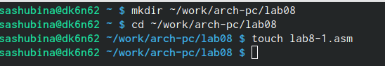{#fig:001 width=70%}

При реализации циклов в NASM с использованием инструкции loop необходимо помнить
о том, что эта инструкция использует регистр ecx в качестве счетчика и на каждом шаге
уменьшает его значение на единицу. В качестве примера рассмотрим программу, которая
выводит значение регистра ecx. Внимательно изучим текст программы
Введем в файл lab8-1.asm текст программы из листинга. Создадим исполняемый файл
и проверим его работу.(рис. @fig:002) (рис. @fig:003).
 
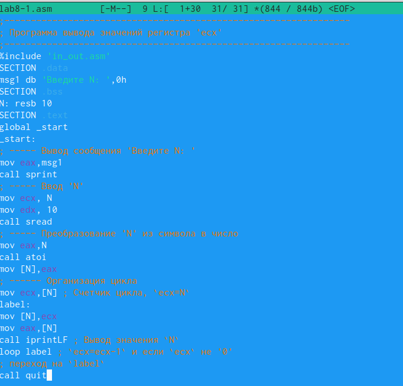{#fig:002 width=70%}

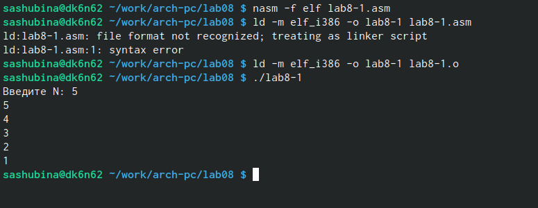{#fig:003 width=70%}

Данный пример показывает, что использование регистра ecx в теле цилка loop может
привести к некорректной работе программы. Изменим текст программы добавив изменение
значение регистра ecx в цикле:
Создадим исполняемый файл и проверим его работу. Какие значения принимает регистр
ecx в цикле? Использование регистра eax в теле цикла loop приводит к некоррректной работе программы.
Соответствует ли число проходов цикла значению 𝑁 введенному с клавиатуры? Нет, число проходов намного больше заявленного N/\.
(рис. @fig:004) (рис. @fig:005).
 
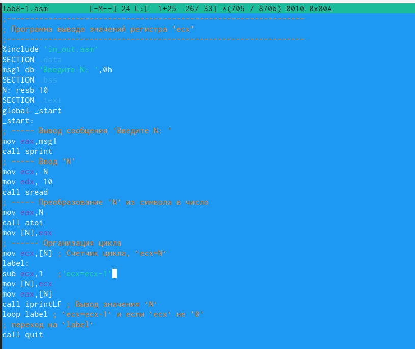{#fig:004 width=70%}

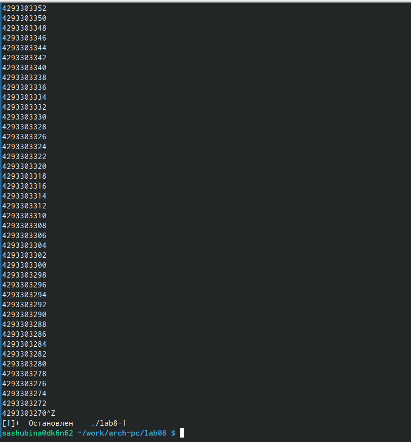{#fig:005 width=70%}

Для использования регистра ecx в цикле и сохранения корректности работы программы
можно использовать стек. Внесем изменения в текст программы добавив команды push
и pop (добавления в стек и извлечения из стека) для сохранения значения счетчика цикла
loop:
Создадим исполняемый файл и проверим его работу. Соответствует ли в данном случае
число проходов цикла значению 𝑁 введенному с клавиатуры?В данном случае число проходов соответствует  введенному числу N.
(рис. @fig:006) (рис. @fig:007).
 
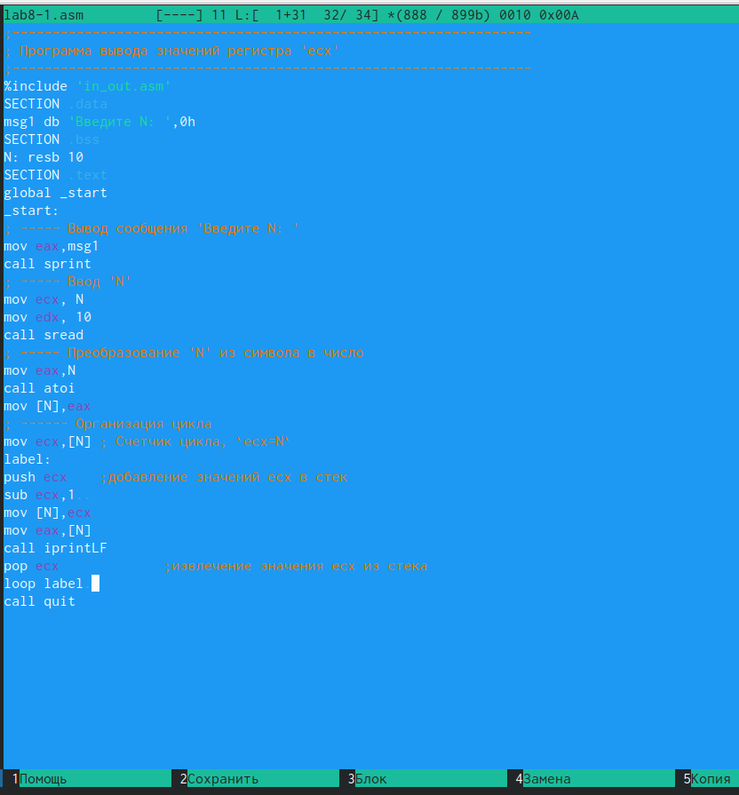{#fig:006 width=70%}

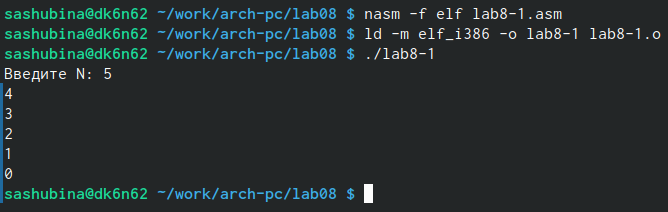{#fig:007 width=70%}

Обработка аргументов командной строки
При разработке программ иногда встает необходимость указывать аргументы, которые
будут использоваться в программе, непосредственно из командной строки при запуске
программы.
При запуске программы в NASM аргументы командной строки загружаются в стек в обрат-
ном порядке, кроме того в стек записывается имя программы и общее количество аргументов.
Последние два элемента стека для программы, скомпилированной NASM, – это всегда имя
программы и количество переданных аргументов.
Таким образом, для того чтобы использовать аргументы в программе, их просто нужно
извлечь из стека. Обработку аргументов нужно проводить в цикле. Т.е. сначала нужно из-
влечь из стека количество аргументов, а затем циклично для каждого аргумента выполнить
логику программы. В качестве примера рассмотрим программу, которая выводит на экран
аргументы командной строки. Внимательно изучим текст программы .
 Программа выводящая на экран аргументы командной строки
Создадим файл lab8-2.asm в каталоге ~/work/arch-pc/lab08 и введем в него текст про-
граммы из листинга.
Создадим исполняемый файл и запустим его, указав аргументы:
user@dk4n31:~$ ./lab8-2 аргумент1 аргумент 2 'аргумент 3'
Сколько аргументов было обработано программой? 4 аргумента обработано программой
(рис. @fig:008) (рис. @fig:009) (рис. @fig:010).
 
{#fig:008 width=70%}

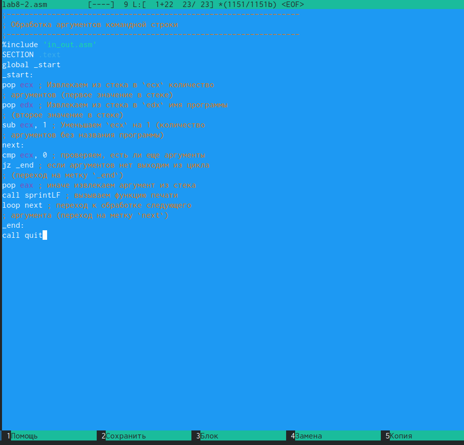{#fig:009 width=70%}

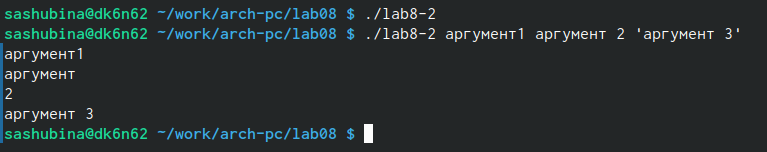{#fig:009 width=70%}

Рассмотрим еще один пример программы которая выводит сумму чисел, которые пере-
даются в программу как аргументы. Создадим файл lab8-3.asm в каталоге ~/work/arch-
pc/lab08 и введите в него текст программы из листинга.
Создадим исполняемый файл и запустим его, указав аргументы. Пример результата работы
программы:
user@dk4n31:~$ ./main 12 13 7 10 5
Результат: 47
user@dk4n31:~$
(рис. @fig:011) (рис. @fig:012) (рис. @fig:013).
 
{#fig:011 width=70%}

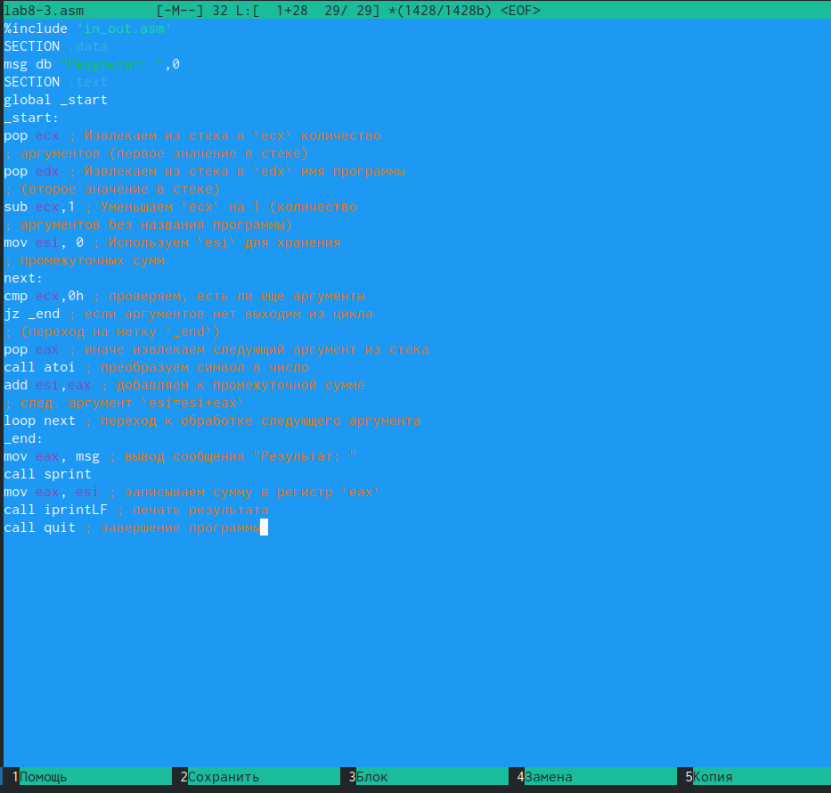{#fig:012 width=70%}

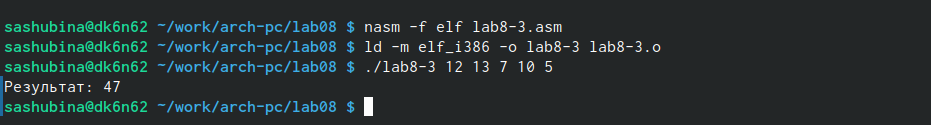{#fig:013 width=70%}
Изменим текст программы из листинга  для вычисления произведения аргументов
командной строки.
(рис. @fig:014) (рис. @fig:015).
 
{#fig:014 width=70%}

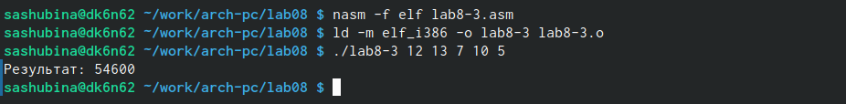{#fig:015 width=70%}


# Задание для самостоятельной работы
1. Напишем программу, которая находит сумму значений функции 𝑓(𝑥) для
𝑥 = 𝑥1, 𝑥2, ..., 𝑥𝑛, т.е. программа должна выводить значение 𝑓(𝑥1) + 𝑓(𝑥2) + ... + 𝑓(𝑥𝑛).
Значения 𝑥𝑖 передаются как аргументы. Вид функции 𝑓(𝑥) выбрать из таблицы
вариантов заданий в соответствии с вариантом, полученным при выполнении
лабораторной работы No 7. 
ВАРИАНТ 6
Создадим исполняемый файл и проверим его работу на
нескольких наборах 𝑥 = 𝑥1, 𝑥2, ..., 𝑥𝑛
Пример работы программы для функции 𝑓(𝑥) = 𝑥 + 2 и набора 𝑥1 = 1, 𝑥2 = 2, 𝑥3 = 3,
𝑥4 = 4:
user@dk4n31:~$ ./main 1 2 3 4
Функция: f(x)=x+2
Результат: 18
user@dk4n31:~$
(рис. @fig:016) (рис. @fig:017).
 
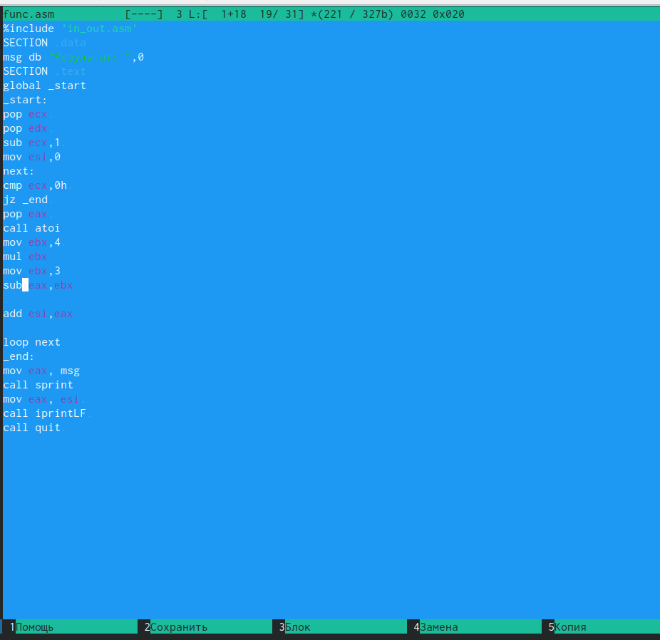{#fig:016 width=70%}

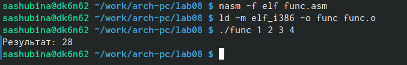{#fig:017 width=70%}
```
%include 'in_out.asm'
SECTION .data
msg db "Результат: ",0
SECTION .text
global _start
_start:
pop ecx 
pop edx 
sub ecx,1 
mov esi,0
next:
cmp ecx,0h 
jz _end 
pop eax 
call atoi
mov ebx,4 
mul ebx
mov ebx,3
sub eax,ebx
 
add esi,eax

loop next
_end:
mov eax, msg
call sprint
mov eax, esi 
call iprintLF 
call quit 
```

# Выводы
 Я приобрела теоретические и практические навыуки написания программ с использованием циклов и обработкой аргументов командной строки.

# Список литературы{.unnumbered}
1. GDB: The GNU Project Debugger. — URL: https://www.gnu.org/software/gdb/.
2. GNU Bash Manual. — 2016. — URL: https://www.gnu.org/software/bash/manual/.
3. Midnight Commander Development Center. — 2021. — URL: https://midnight-commander.
org/.
4. NASM Assembly Language Tutorials. — 2021. — URL: https://asmtutor.com/.
5. Newham C. Learning the bash Shell: Unix Shell Programming. — O’Reilly Media, 2005. —
354 с. — (In a Nutshell). — ISBN 0596009658. — URL: http://www.amazon.com/Learning-
bash-Shell-Programming-Nutshell/dp/0596009658.
6. Robbins A. Bash Pocket Reference. — O’Reilly Media, 2016. — 156 с. — ISBN 978-1491941591.
7. The NASM documentation. — 2021. — URL: https://www.nasm.us/docs.php.
8. Zarrelli G. Mastering Bash. — Packt Publishing, 2017. — 502 с. — ISBN 9781784396879.
9. Колдаев В. Д., Лупин С. А. Архитектура ЭВМ. — М. : Форум, 2018.
10. Куляс О. Л., Никитин К. А. Курс программирования на ASSEMBLER. — М. : Солон-Пресс,
2017.
11. Новожилов О. П. Архитектура ЭВМ и систем. — М. : Юрайт, 2016.
12. Расширенный ассемблер: NASM. — 2021. — URL: https://www.opennet.ru/docs/RUS/nasm/.
13. Робачевский А., Немнюгин С., Стесик О. Операционная система UNIX. — 2-е изд. — БХВ-
Петербург, 2010. — 656 с. — ISBN 978-5-94157-538-1.
14. Столяров А. Программирование на языке ассемблера NASM для ОС Unix. — 2-е изд. —
М. : МАКС Пресс, 2011. — URL: http://www.stolyarov.info/books/asm_unix.
15. Таненбаум Э. Архитектура компьютера. — 6-е изд. — СПб. : Питер, 2013. — 874 с. —
(Классика Computer Science).
16. Таненбаум Э., Бос Х. Современные операционные системы. — 4-е изд. — СПб. : Питер,
2015. — 1120 с. — (Классика Computer Science).
