---
## Front matter
title: "Отчет по лабораторной работе № 9"

author: "Шубина София Антоновна"

## Generic otions
lang: ru-RU
toc-title: "Содержание"

## Bibliography
bibliography: bib/cite.bib
csl: pandoc/csl/gost-r-7-0-5-2008-numeric.csl

## Pdf output format
toc: true # Table of contents
toc-depth: 2
lof: true # List of figures
lot: true # List of tables
fontsize: 12pt
linestretch: 1.5
papersize: a4
documentclass: scrreprt
## I18n polyglossia
polyglossia-lang:
  name: russian
  options:
	- spelling=modern
	- babelshorthands=true
polyglossia-otherlangs:
  name: english
## I18n babel
babel-lang: russian
babel-otherlangs: english
## Fonts
mainfont: PT Serif
romanfont: PT Serif
sansfont: PT Sans
monofont: PT Mono
mainfontoptions: Ligatures=TeX
romanfontoptions: Ligatures=TeX
sansfontoptions: Ligatures=TeX,Scale=MatchLowercase
monofontoptions: Scale=MatchLowercase,Scale=0.9
## Biblatex
biblatex: true
biblio-style: "gost-numeric"
biblatexoptions:
  - parentracker=true
  - backend=biber
  - hyperref=auto
  - language=auto
  - autolang=other*
  - citestyle=gost-numeric
## Pandoc-crossref LaTeX customization
figureTitle: "Рис."
tableTitle: "Таблица"
listingTitle: "Листинг"
lofTitle: "Список иллюстраций"
lotTitle: "Список таблиц"
lolTitle: "Листинги"
## Misc options
indent: true
header-includes:
  - \usepackage{indentfirst}
  - \usepackage{float} # keep figures where there are in the text
  - \floatplacement{figure}{H} # keep figures where there are in the text
---

# Цель работы
Приобретение навыков написания программ с использованием подпрограмм. Знакомство
с методами отладки при помощи GDB и его основными возможностями


# Выполнение лабораторной работы
Реализация подпрограмм в NASM
1. Создадим каталог для выполнения лабораторной работы No 9, перейдем в него и со-
здадим файл lab09-1.asm:
mkdir ~/work/arch-pc/lab09
cd ~/work/arch-pc/lab09
touch lab09-1.asm
(рис. @fig:001).

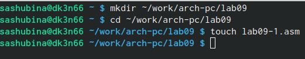{#fig:001 width=70%}

2. В качестве примера рассмотрим программу вычисления арифметического выражения
𝑓(𝑥) = 2𝑥 + 7 с помощью подпрограммы _calcul. В данном примере 𝑥 вводится с
клавиатуры, а само выражение вычисляется в подпрограмме. Внимательно изучим текст программы.
Первые строки программы отвечают за вывод сообщения на экран (call sprint), чтение
данных введенных с клавиатуры (call sread) и преобразования введенных данных из
символьного вида в численный (call atoi)
После следующей инструкции call _calcul, которая передает управление подпрограмме
_calcul, будут выполнены инструкции подпрограммы
Инструкция ret является последней в подпрограмме и ее исполнение приводит к воз-
вращению в основную программу к инструкции, следующей за инструкцией call, которая
вызвала данную подпрограмму.
Последние строки программы реализую вывод сообщения (call sprint), результата вы-
числения (call iprintLF) и завершение программы (call quit).

Введем в файл lab09-1.asm текст программы из листинга. Создадим исполняемый
файл и проверим его работу.
(рис. @fig:002, @fig:003).

{#fig:002 width=70%}

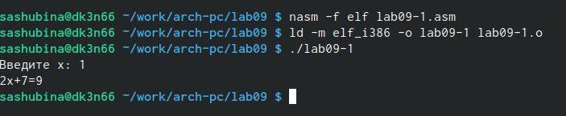{#fig:003 width=70%}

Изменим текст программы, добавив подпрограмму _subcalcul в подпрограмму _calcul,
для вычисления выражения 𝑓(𝑔(𝑥)), где 𝑥 вводится с клавиатуры, 𝑓(𝑥) = 2𝑥 + 7, 𝑔(𝑥) =
3𝑥 − 1. Т.е. 𝑥 передается в подпрограмму _calcul из нее в подпрограмму _subcalcul, где
вычисляется выражение 𝑔(𝑥), результат возвращается в _calcul и вычисляется выражение
𝑓(𝑔(𝑥)). Результат возвращается в основную программу для вывода результата на экран.
тладка программам с помощью GDB
(рис. @fig:004, @fig:005, @fig:006).

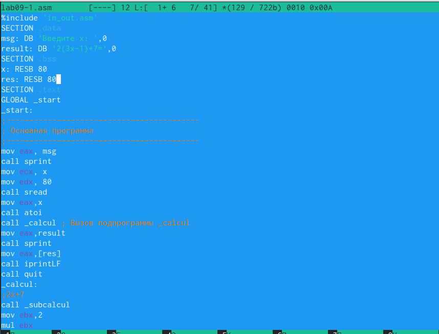{#fig:004 width=70%}
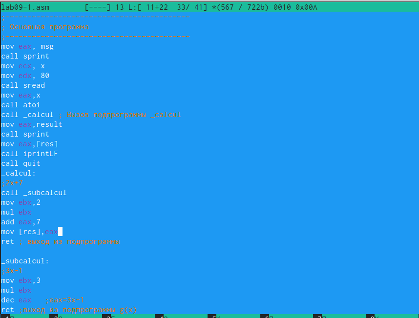{#fig:005 width=70%}
{#fig:006 width=70%}

Создадим файл lab09-2.asm с текстом программы из Листинга. (Программа печати
сообщения Hello world!)
(рис. @fig:007).

{#fig:007 width=70%}

Получим исполняемый файл. Для работы с GDB в исполняемый файл необходимо добавить
отладочную информацию, для этого трансляцию программ необходимо проводить с ключом
‘-g’.
nasm -f elf -g -l lab09-2.lst lab09-2.asm
ld -m elf_i386 -o lab09-2 lab09-2.o
Загрузим исполняемый файл в отладчик gdb:
user@dk4n31:~$ gdb lab09-2
(рис. @fig:008).

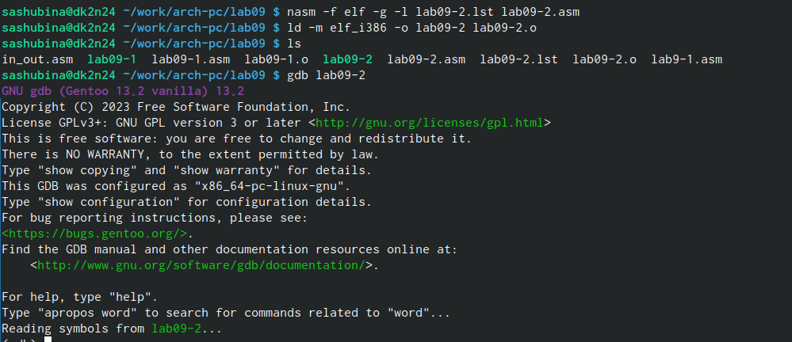{#fig:008 width=70%}

Проверим работу программы, запустив ее в оболочке GDB с помощью команды run (со-
кращённо r):
(gdb) run
(рис. @fig:009).

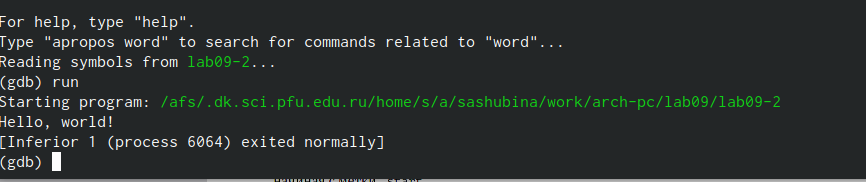{#fig:009 width=70%}

Starting program: ~/work/arch-pc/lab09/lab09-2
Hello, world!
[Inferior 1 (process 10220) exited normally]
(gdb)
Для более подробного анализа программы установите брейкпоинт на метку _start, с
которой начинается выполнение любой ассемблерной программы, и запустите её.
(gdb) break _start
(рис. @fig:010).

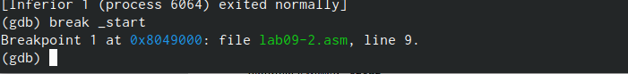{#fig:010 width=70%}

Breakpoint 1 at 0x8049000: file lab09-2.asm, line 12.
(gdb) run
Starting program: ~/work/arch-pc/lab09/lab09-2
Breakpoint 1, _start () at lab09-2.asm:12
12 mov eax, 4

Посмотрим дисассимилированный код программы с помощью команды disassemble
начиная с метки _start
(gdb) disassemble _start
(рис. @fig:011).

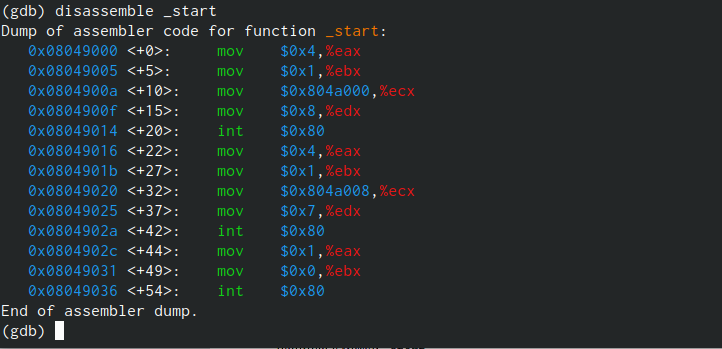{#fig:011 width=70%}

Переключимся на отображение команд с Intel’овским синтаксисом, введя команду 
set
disassembly-flavor intel
(gdb) set disassembly-flavor intel
(gdb) disassemble _start
(рис. @fig:012).

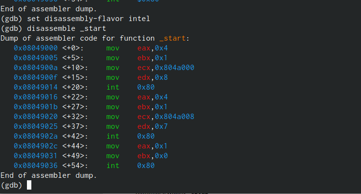{#fig:012 width=70%}

Перечислим различия отображения синтаксиса машинных команд в режимах ATT и Intel. -
В синтаксисе  Intel вводится регистр после команды с помещенным значением, после вводится адрес помещаемого значения или число.
В синтаксисе  ATT сначала выводится ссылка на заносимое в регистр значение с помощью символа "$", а после нее регистр с символом.

Включите режим псевдографики для более удобного анализа программы:
(gdb) layout asm
(gdb) layout regs
(рис. @fig:013, @fig:014).

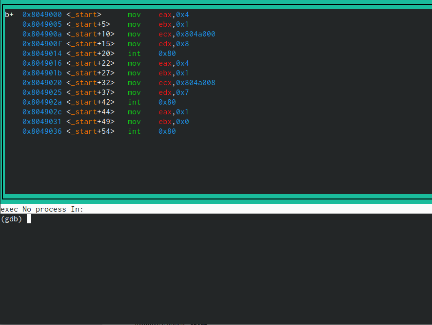{#fig:013 width=70%}

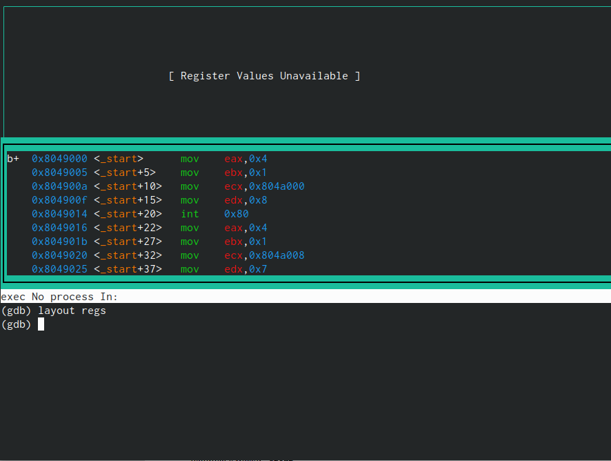{#fig:014 width=70%}

В этом режиме есть три окна:
• В верхней части видны названия регистров и их текущие значения;
• В средней части виден результат дисассимилирования программы;
• Нижняя часть доступна для ввода команд.
бавление точек останова
Установить точку останова можно командой break (кратко b). Типичный аргумент этой
команды — место установки. Его можно задать или как номер строки программы (имеет
смысл, если есть исходный файл, а программа компилировалась с информацией об отладке),
или как имя метки, или как адрес. Чтобы не было путаницы с номерами, перед адресом
ставится «звёздочка»:

На предыдущих шагах была установлена точка останова по имени метки (_start). 
Проверим это с помощью команды info breakpoints (кратко i b):
(gdb) info breakpoints
(рис. @fig:015).

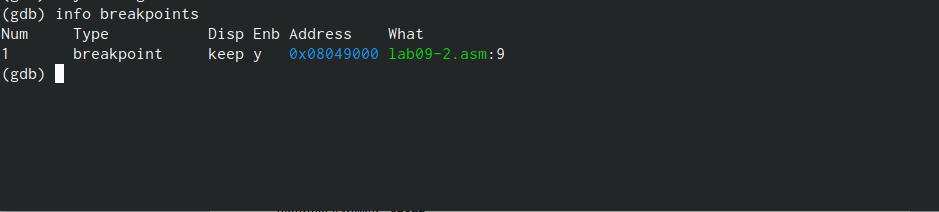{#fig:015 width=70%}

Установим еще одну точку останова по адресу инструкции. Адрес инструкции можно
увидеть в средней части экрана в левом столбце соответствующей инструкции.
Определите адрес предпоследней инструкции (mov ebx,0x0) и установите точку останова.
(gdb) break *<адрес>
Посмотрите информацию о всех установленных точках останова:
(gdb) i b
(рис. @fig:016, @fig:017).

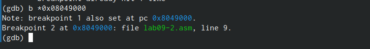{#fig:016 width=70%}

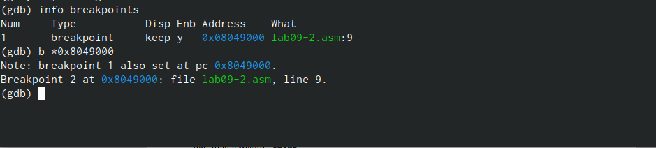{#fig:017 width=70%}

Работа с данными программы в GDB
Отладчик может показывать содержимое ячеек памяти и регистров, а при необходимости
позволяет вручную изменять значения регистров и переменных.

Выполним 5 инструкций с помощью команды stepi (или si) и проследим за изменением
значений регистров. Значения каких регистров изменяются? 
Изменились значения регистров:eax,ecx,edx,ebx, значения остальных регистров не изменились.
(рис. @fig:018, @fig:019,@fig:20, @fig:021,@fig:022).

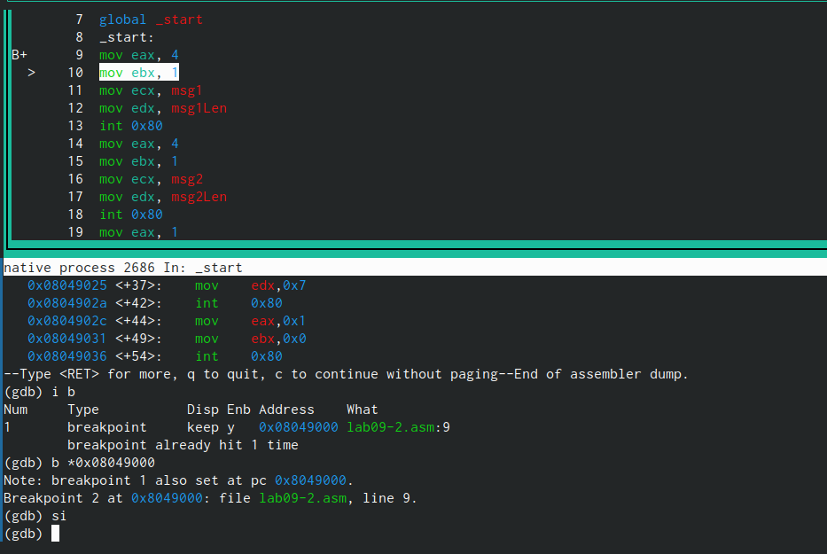{#fig:018 width=70%}

{#fig:019 width=70%}

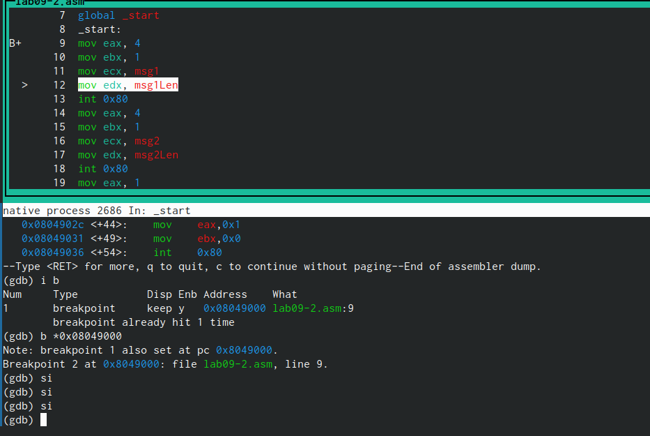{#fig:020 width=70%}

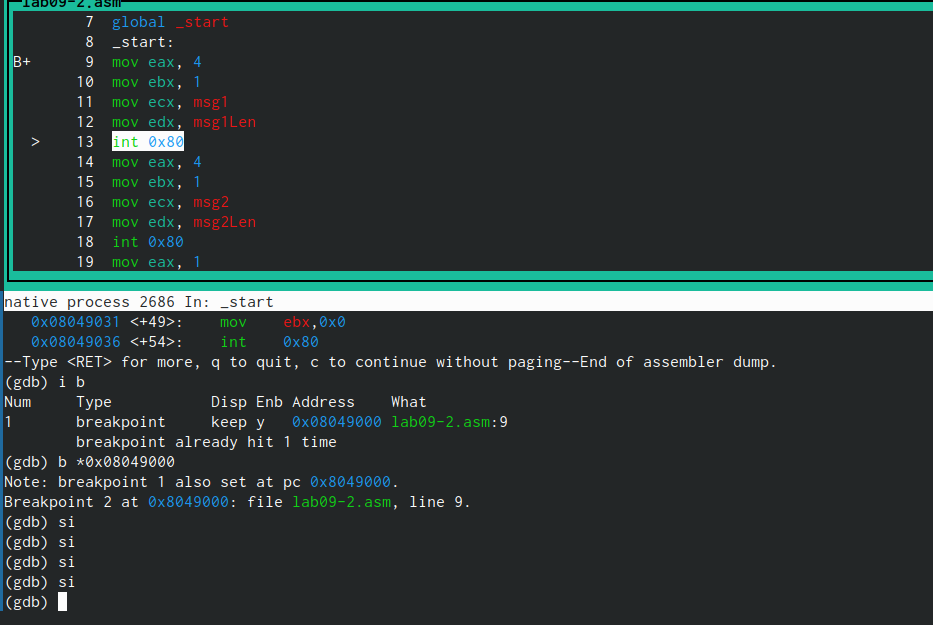{#fig:021 width=70%}

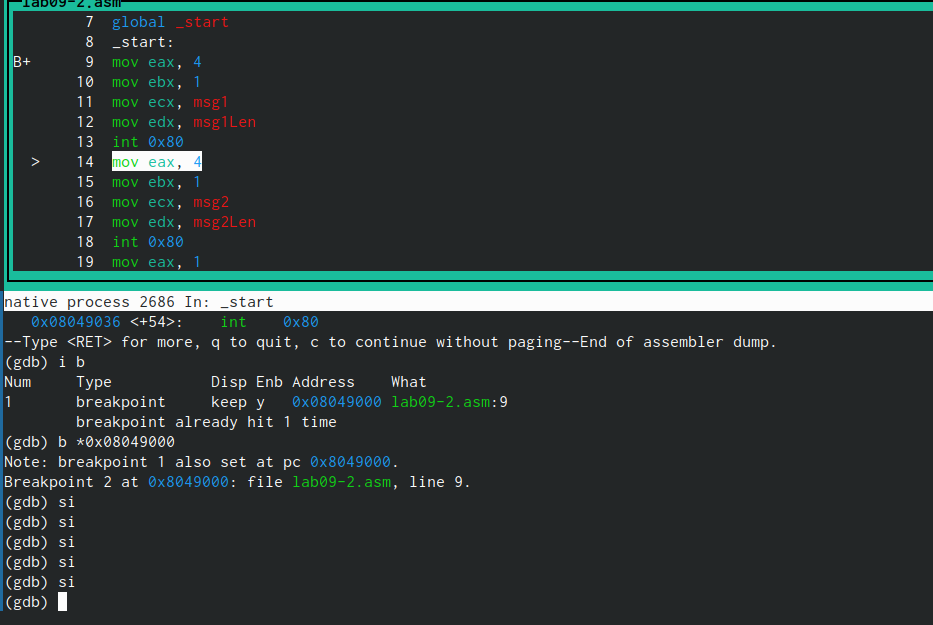{#fig:022 width=70%}

Посмотреть содержимое регистров также можно с помощью команды info registers
(или i r).
(gdb) info registers
(рис. @fig:023).

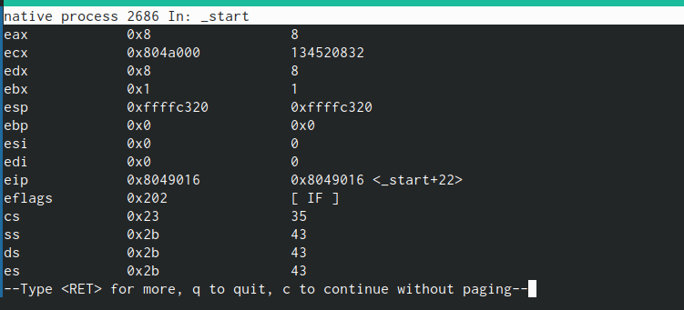{#fig:023 width=70%}

Для отображения содержимого памяти можно использовать команду x <адрес>, которая
выдаёт содержимое ячейки памяти по указанному адресу. Формат, в котором выводятся
данные, можно задать после имени команды через косую черту: x/NFU <адрес>.
С помощью команды x &<имя переменной> также можно посмотреть содержимое пере-
менной.

Посмотрим значение переменной msg1 по имени
(gdb) x/1sb &msg1
0x804a000 <msg1>: "Hello, "
(рис. @fig:024).

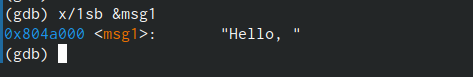{#fig:024 width=70%}

Посмотрите значение переменной msg2 по адресу. Адрес переменной можно определить
по дизассемблированной инструкции. Посмотрите инструкцию mov ecx,msg2 которая запи-
сывает в регистр ecx адрес перемененной msg2
(рис. @fig:025).

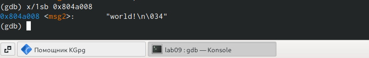{#fig:025 width=70%}

Изменить значение для регистра или ячейки памяти можно с помощью команды set,
задав ей в качестве аргумента имя регистра или адрес. При этом перед именем регистра
ставится префикс $, а перед адресом нужно указать в фигурных скобках тип данных (раз-
мер сохраняемого значения; в качестве типа данных можно использовать типы языка Си).

Изменим первый символ переменной msg1:
(gdb) set {char}msg1='h'
(gdb) x/1sb &msg1
0x804a000 <msg1>: "hello, "
(gdb)
Заменим любой символ во второй переменной msg2.
(рис. @fig:026).

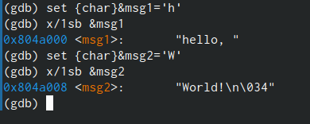{#fig:026 width=70%}

Чтобы посмотреть значения регистров используется команда print /F <val> (перед име-
нем регистра обязательно ставится префикс $):
p/F $<регистр>
(рис. @fig:027).

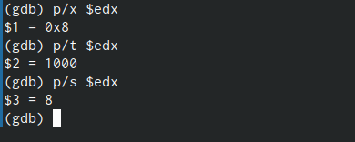{#fig:027 width=70%}

Выведем в различных форматах (в шестнадцатеричном формате, в двоичном формате и
в символьном виде) значение регистра edx.
С помощью команды set изменим значение регистра ebx:
(gdb) set $ebx='2'
(gdb) p/s $ebx
$3 = 50
(gdb) set $ebx=2
(gdb) p/s $ebx
$4 = 2
(gdb)
(рис. @fig:028).

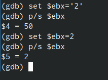{#fig:028 width=70%}
Объясните разницу вывода команд p/s $ebx.
Мы занесли в регистр ebx символ "2", после значения регистра видим код символа "2".
Если занести в регистр изначально число "2", а не символ, то команда вывела значение "2".

Завершим выполнение программы с помощью команды continue (сокращенно c) или
stepi (сокращенно si) и выйдем из GDB с помощью команды quit (сокращенно q).
(рис. @fig:029).

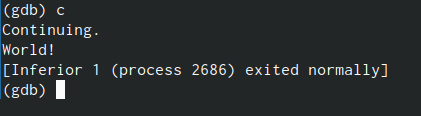{#fig:029 width=70%}

Обработка аргументов командной строки в GDB
Скопируем файл lab8-2.asm, созданный при выполнении лабораторной работы No8,
с программой выводящей на экран аргументы командной строки в файл с
именем lab09-3.asm:
cp ~/work/arch-pc/lab08/lab8-2.asm ~/work/arch-pc/lab09/lab09-3.asm
Создайте исполняемый файл.
nasm -f elf -g -l lab09-3.lst lab09-3.asm
ld -m elf_i386 -o lab09-3 lab09-3.o
(рис. @fig:030).

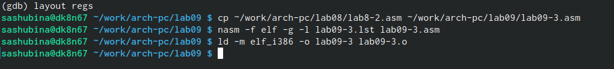{#fig:030 width=70%}

Для загрузки в gdb программы с аргументами необходимо использовать ключ --args.
Загрузим исполняемый файл в отладчик, указав аргументы:
gdb --args lab09-3 аргумент1 аргумент 2 'аргумент 3'
(рис. @fig:031).

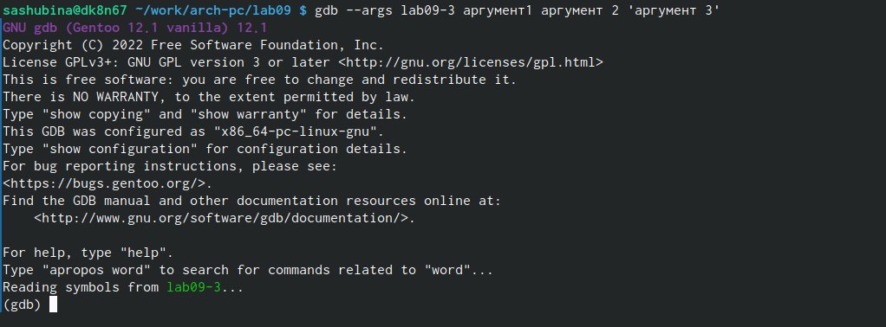{#fig:031 width=70%}

Как отмечалось в предыдущей лабораторной работе, при запуске программы аргументы
командной строки загружаются в стек. Исследуем расположение аргументов командной
строки в стеке после запуска программы с помощью gdb.
Для начала установим точку останова перед первой инструкцией в программе и запустим
ее.
(gdb) b _start
(gdb) run
(рис. @fig:032).

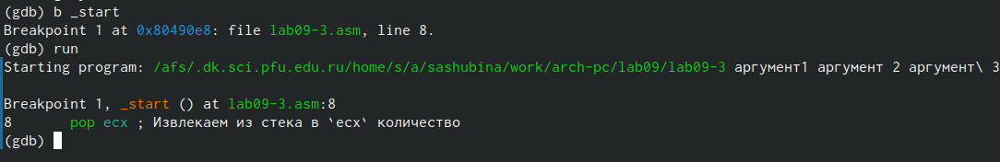{#fig:032 width=70%}

Адрес вершины стека храниться в регистре esp и по этому адресу располагается число
равное количеству аргументов командной строки (включая имя программы):
(gdb) x/x $esp
0xffffd200: 0x05
(рис. @fig:033).

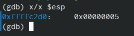{#fig:033 width=70%}

Как видно, число аргументов равно 5 – это имя программы lab09-3 и непосредственно
аргументы: аргумент1, аргумент, 2 и 'аргумент 3'.
Посмотриv остальные позиции стека – по адесу [esp+4] располагается адрес в памяти
где находиться имя программы, по адесу [esp+8] храниться адрес первого аргумента, по
аресу [esp+12] – второго и т.д.
(рис. @fig:034).

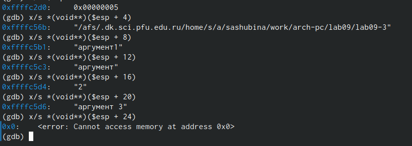{#fig:034 width=70%}

Объясните, почему шаг изменения адреса равен 4 ([esp+4], [esp+8], [esp+12] и т.д.).
Шаг равен 4 ,потому что при прибавлении значений аргументов в стеке значение регистра esp увеличивается на 4.
#Задание для самостоятельной работы
1. Преобразуем программу из лабораторной работы №8 (Задание No1 для самостоятель-
ной работы), реализовав вычисление значения функции 𝑓(𝑥) как подпрограмму.
(рис. @fig:044).

```nasm

%include 'in_out.asm'
SECTION .data
msg db "Результат: ",0
SECTION .text
global _start

_start:
pop ecx 
pop edx 
sub ecx,1 
mov esi,0

next:
cmp ecx,0h 
jz _end 
pop eax 
call atoi
call _calcul
add esi,eax
loop next
_end:
mov eax, msg
call sprint
mov eax, esi 
call iprintLF 
call quit 

_calcul:
mov ebx,4 
mul ebx
mov ebx,3
sub eax,ebx
ret
```

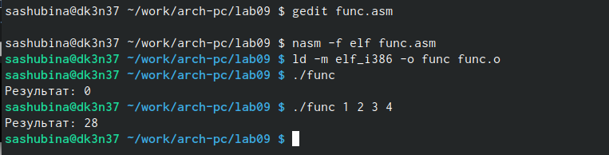{#fig:044 width=70%

2. В листинге 9.3 приведена программа вычисления выражения (3 + 2) ∗ 4 + 5. При запуске
данная программа дает неверный результат. Проверим это. С помощью отладчика GDB,
анализируя изменения значений регистров, определим ошибку и исправим ее.
Создадим файл f2.asm и впишем в него текст программы вычисления выражения.
(рис. @fig:035).

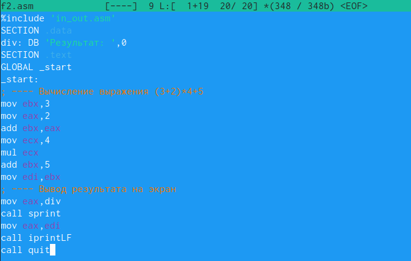{#fig:035 width=70%}

Создадим исполняемый файл и запустим его
(рис. @fig:036).

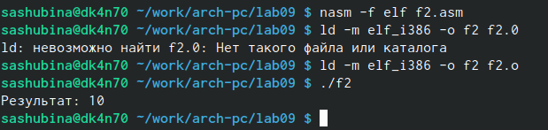{#fig:036 width=70%}

При запуске програма дает неверный результат.
С помощью отладчика GDB  проанализируем изменения значений регистров, исправим ошибку.
Загрузим исполняемый файл в отладчик.
(рис. @fig:037).

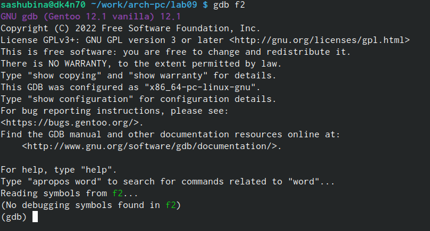{#fig:037 width=70%}

 Просмотр дисассемилированного кода программы
(рис. @fig:038).

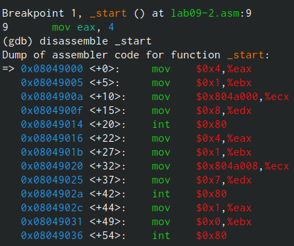{#fig:038 width=70%}

Включим режим псевдографики, с помощью команды break  установим точку основа на иструкции add,ebx,eax.
С помощью команды si перейдем к следующей инструкции и проследим за изменением значений регистров.
(рис. @fig:039).

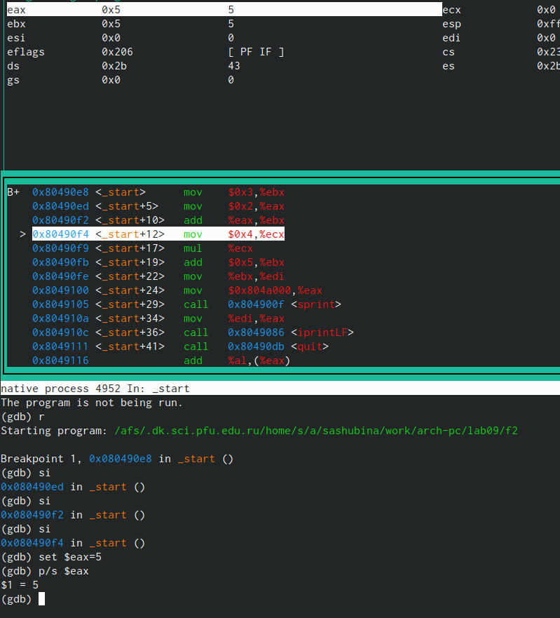{#fig:039 width=70%}

Чтобы исправить программу, занесем в eax  с помощью команды set значение 5.
(рис. @fig:040).

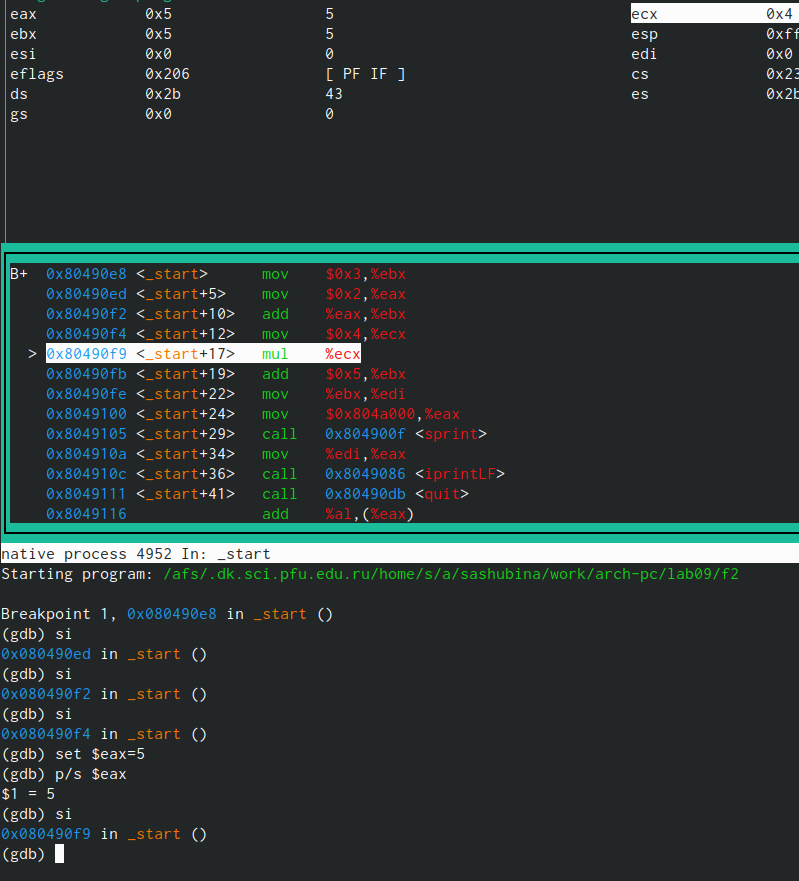{#fig:040 width=70%}

За результат программы отвечает регистр ebx. В него посместим значение 20+5 и запустим программу.

(рис. @fig:041).

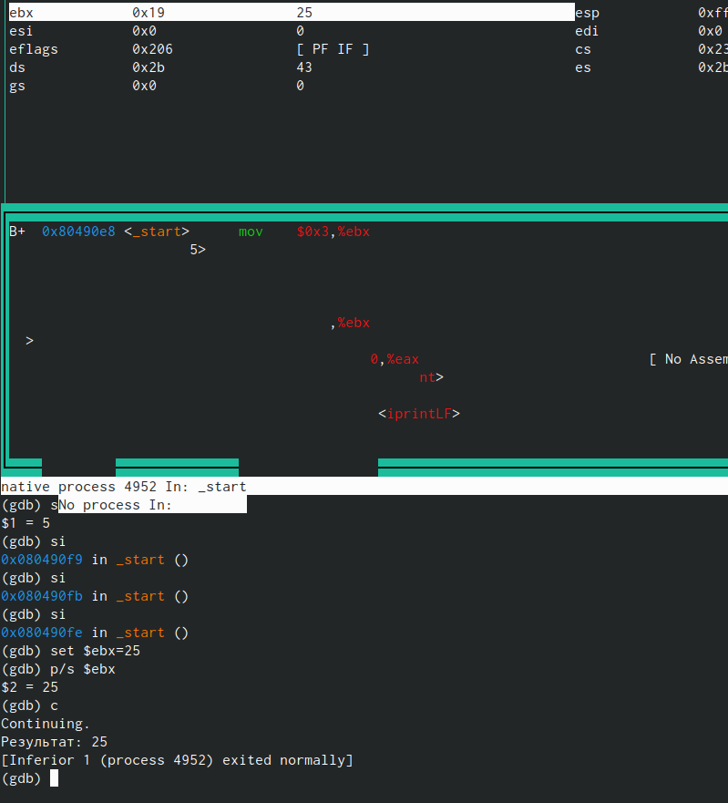{#fig:041 width=70%}

Изменим текст программы.
(рис. @fig:042).

{#fig:042 width=70%}

Запустим исполняемый файл, программа выдает верный результат.
(рис. @fig:043).

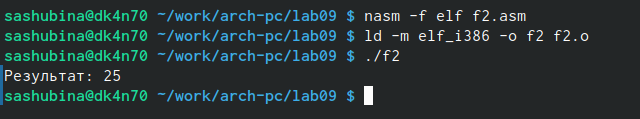{#fig:043 width=70%}


# Выводы

Я приобрела навыки написания программ с использованием подпрограмм. 
Ознакомилась с методами отладки при помощи GDB и его основными возможностями.

# Список литературы{.unnumbered}
1. GDB: The GNU Project Debugger. — URL: https://www.gnu.org/software/gdb/.
2. GNU Bash Manual. — 2016. — URL: https://www.gnu.org/software/bash/manual/.
3. Midnight Commander Development Center. — 2021. — URL: https://midnight-commander.
org/.
4. NASM Assembly Language Tutorials. — 2021. — URL: https://asmtutor.com/.
5. Newham C. Learning the bash Shell: Unix Shell Programming. — O’Reilly Media, 2005. —
354 с. — (In a Nutshell). — ISBN 0596009658. — URL: http://www.amazon.com/Learning-
bash-Shell-Programming-Nutshell/dp/0596009658.
6. Robbins A. Bash Pocket Reference. — O’Reilly Media, 2016. — 156 с. — ISBN 978-1491941591.
7. The NASM documentation. — 2021. — URL: https://www.nasm.us/docs.php.
8. Zarrelli G. Mastering Bash. — Packt Publishing, 2017. — 502 с. — ISBN 9781784396879.
9. Колдаев В. Д., Лупин С. А. Архитектура ЭВМ. — М. : Форум, 2018.
10. Куляс О. Л., Никитин К. А. Курс программирования на ASSEMBLER. — М. : Солон-Пресс,
2017.
11. Новожилов О. П. Архитектура ЭВМ и систем. — М. : Юрайт, 2016.
12. Расширенный ассемблер: NASM. — 2021. — URL: https://www.opennet.ru/docs/RUS/nasm/.
13. Робачевский А., Немнюгин С., Стесик О. Операционная система UNIX. — 2-е изд. — БХВ-
Петербург, 2010. — 656 с. — ISBN 978-5-94157-538-1.
14. Столяров А. Программирование на языке ассемблера NASM для ОС Unix. — 2-е изд. —
М. : МАКС Пресс, 2011. — URL: http://www.stolyarov.info/books/asm_unix.
15. Таненбаум Э. Архитектура компьютера. — 6-е изд. — СПб. : Питер, 2013. — 874 с. —
(Классика Computer Science).
16. Таненбаум Э., Бос Х. Современные операционные системы. — 4-е изд. — СПб. : Питер,
2015. — 1120 с. — (Классика Computer Science).
