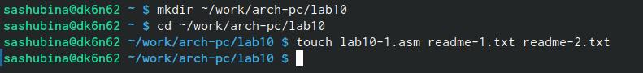
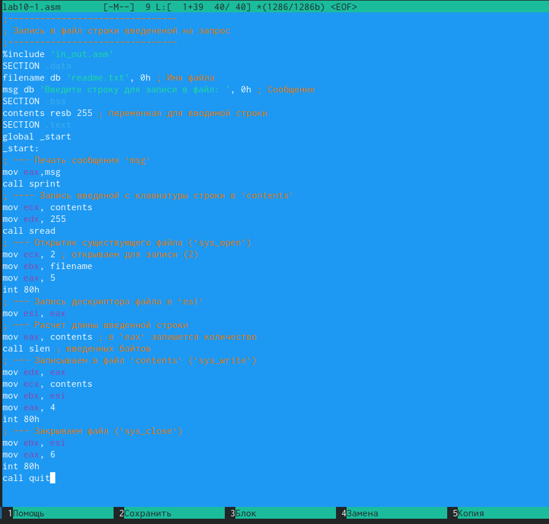
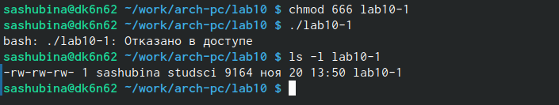
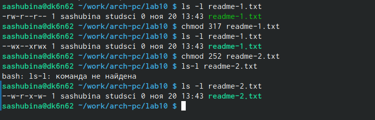
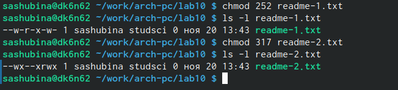
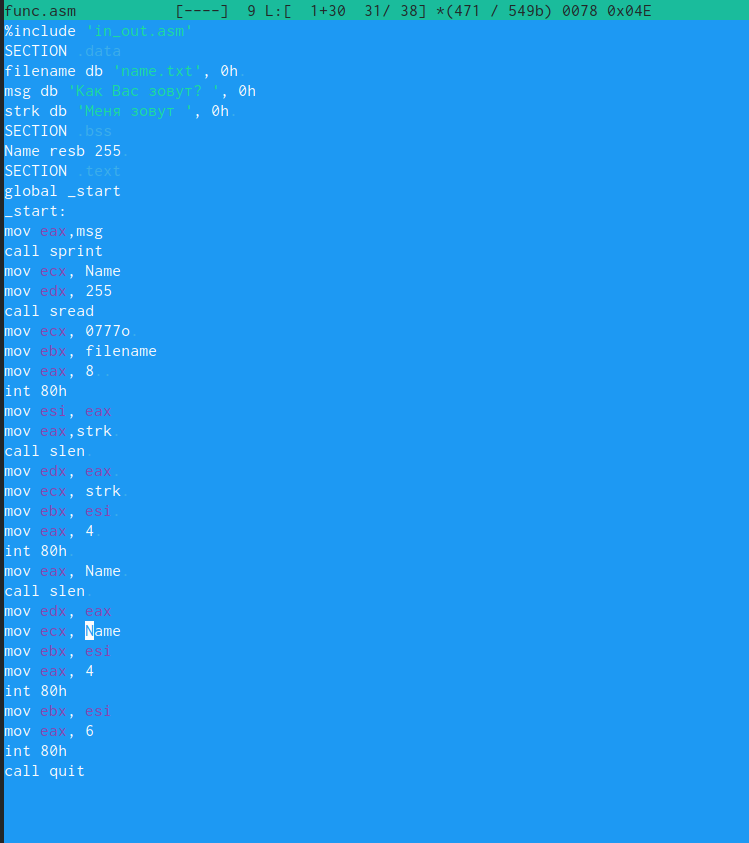
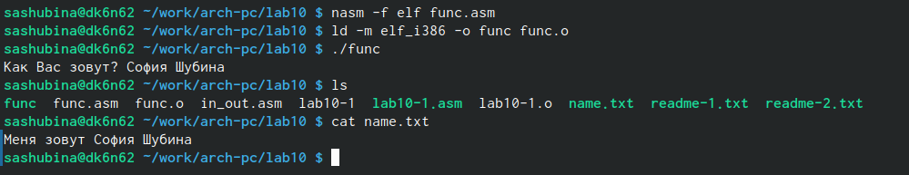

---
## Front matter
title: "Отчет по лабораторной работе №10"
subtitle: "Простейший вариант"
author: "Шубина София Антоновна"

## Generic otions
lang: ru-RU
toc-title: "Содержание"

## Bibliography
bibliography: bib/cite.bib
csl: pandoc/csl/gost-r-7-0-5-2008-numeric.csl

## Pdf output format
toc: true # Table of contents
toc-depth: 2
lof: true # List of figures
lot: true # List of tables
fontsize: 12pt
linestretch: 1.5
papersize: a4
documentclass: scrreprt
## I18n polyglossia
polyglossia-lang:
  name: russian
  options:
	- spelling=modern
	- babelshorthands=true
polyglossia-otherlangs:
  name: english
## I18n babel
babel-lang: russian
babel-otherlangs: english
## Fonts
mainfont: PT Serif
romanfont: PT Serif
sansfont: PT Sans
monofont: PT Mono
mainfontoptions: Ligatures=TeX
romanfontoptions: Ligatures=TeX
sansfontoptions: Ligatures=TeX,Scale=MatchLowercase
monofontoptions: Scale=MatchLowercase,Scale=0.9
## Biblatex
biblatex: true
biblio-style: "gost-numeric"
biblatexoptions:
  - parentracker=true
  - backend=biber
  - hyperref=auto
  - language=auto
  - autolang=other*
  - citestyle=gost-numeric
## Pandoc-crossref LaTeX customization
figureTitle: "Рис."
tableTitle: "Таблица"
listingTitle: "Листинг"
lofTitle: "Список иллюстраций"
lotTitle: "Список таблиц"
lolTitle: "Листинги"
## Misc options
indent: true
header-includes:
  - \usepackage{indentfirst}
  - \usepackage{float} # keep figures where there are in the text
  - \floatplacement{figure}{H} # keep figures where there are in the text
---

# Цель работы
Приобретение навыков написания программ для работы с файлами.

# Выполнение лабораторной работы
1. Создадим каталог для программам лабораторной работы No 10, перейдем в него и
создадим файлы lab10-1.asm, readme-1.txt и readme-2.txt:
mkdir ~/work/arch-pc/lab09
cd ~/work/arch-pc/lab09
touch lab10-1.asm readme-1.txt readme-2.txt
(рис. @fig:001).

{#fig:001 width=70%}

2. Введем в файл lab10-1.asm текст программы из листинга (Программа записи в
файл сообщения). Создаем исполняемый файл и проверим его работу.
(рис. @fig:002 , @fig:003) 

{#fig:002 width=70%}

{#fig:003 width=70%}

3. С помощью команды chmod изменим права доступа к исполняемому файлу lab10-1,
запретив его выполнение. Попытаемся выполнить файл. Объясним результат.-Файл не выполнился,потому что мы запретили прва доступа к выполнению
(рис. @fig:004).

{#fig:004 width=70%}

4. С помощью команды chmod измените права доступа к файлу lab10-1.asm с исходным
текстом программы, добавив права на исполнение. Попытайтесь выполнить его и
объясните результат.-Текстовый файл не должен исполняться даже после разрешения доступа к выполнению, потому что он не является исполняемым.
(рис. @fig:005).

{#fig:005 width=70%}

5. В соответствии с вариантом в таблице 10.4 предоставить права доступа к файлу readme-
1.txt представленные в символьном виде, а для файла readme-2.txt – в двочном виде. Права на доступ к файлу предоставляются в символьном виде по разрешению преподавателя,т.к. в двоичном виде программа не работает
Проверить правильность выполнения с помощью команды ls -l.
(рис. @fig:006).

{#fig:006 width=70%}

#Задание для самостоятельной работы
1. Напишите программу работающую по следующему алгоритму:
• Вывод приглашения “Как Вас зовут?”
• ввести с клавиатуры свои фамилию и имя
• создать файл с именем name.txt
• записать в файл сообщение “Меня зовут”
• дописать в файл строку введенную с клавиатуры
• закрыть файл
Архитектура ЭВМ
Создать исполняемый файл и проверить его работу. Проверить наличие файла и его
содержимое с помощью команд ls и cat.
 (рис. @fig:007 , @fig:008).

{#fig:007 width=70%}


{#fig:008 width=70%}
```
%include 'in_out.asm'
SECTION .data
filename db 'name.txt', 0h 
msg db 'Как Вас зовут? ', 0h
strk db 'Меня зовут ', 0h 
SECTION .bss
Name resb 255 
SECTION .text
global _start
_start:
mov eax,msg
call sprint
mov ecx, Name
mov edx, 255
call sread
mov ecx, 0777o 
mov ebx, filename
mov eax, 8  
int 80h
mov esi, eax
mov eax,strk 
call slen 
mov edx, eax 
mov ecx, strk 
mov ebx, esi 
mov eax, 4 
int 80h 
mov eax, Name 
call slen 
mov edx, eax
mov ecx, Name
mov ebx, esi
mov eax, 4
int 80h
mov ebx, esi
mov eax, 6
int 80h
call quit
```
# Выводы

Я приобрела навыки написания пррограмм для работы с файлами.

# Список литературы{.unnumbered}
1. GDB: The GNU Project Debugger. — URL: https://www.gnu.org/software/gdb/.
2. GNU Bash Manual. — 2016. — URL: https://www.gnu.org/software/bash/manual/.
3. Midnight Commander Development Center. — 2021. — URL: https://midnight-commander.
org/.
4. NASM Assembly Language Tutorials. — 2021. — URL: https://asmtutor.com/.
5. Newham C. Learning the bash Shell: Unix Shell Programming. — O’Reilly Media, 2005. —
354 с. — (In a Nutshell). — ISBN 0596009658. — URL: http://www.amazon.com/Learning-
bash-Shell-Programming-Nutshell/dp/0596009658.
6. Robbins A. Bash Pocket Reference. — O’Reilly Media, 2016. — 156 с. — ISBN 978-1491941591.
7. The NASM documentation. — 2021. — URL: https://www.nasm.us/docs.php.
8. Zarrelli G. Mastering Bash. — Packt Publishing, 2017. — 502 с. — ISBN 9781784396879.
9. Колдаев В. Д., Лупин С. А. Архитектура ЭВМ. — М. : Форум, 2018.
10. Куляс О. Л., Никитин К. А. Курс программирования на ASSEMBLER. — М. : Солон-Пресс,
2017.
11. Новожилов О. П. Архитектура ЭВМ и систем. — М. : Юрайт, 2016.
12. Расширенный ассемблер: NASM. — 2021. — URL: https://www.opennet.ru/docs/RUS/nasm/.
13. Робачевский А., Немнюгин С., Стесик О. Операционная система UNIX. — 2-е изд. — БХВ-
Петербург, 2010. — 656 с. — ISBN 978-5-94157-538-1.
14. Столяров А. Программирование на языке ассемблера NASM для ОС Unix. — 2-е изд. —
М. : МАКС Пресс, 2011. — URL: http://www.stolyarov.info/books/asm_unix.
15. Таненбаум Э. Архитектура компьютера. — 6-е изд. — СПб. : Питер, 2013. — 874 с. —
(Классика Computer Science).
16. Таненбаум Э., Бос Х. Современные операционные системы. — 4-е изд. — СПб. : Питер,
2015. — 1120 с. — (Классика Computer Science).
